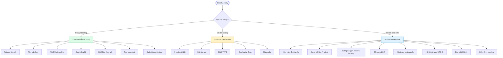

# Tài liệu hệ thống

**Rút gọn link — Phòng GDPT-GDTX Sở GDĐT Đồng Nai** · phiên bản 1.0.0

---

## Chọn tài liệu theo việc bạn cần làm

| Bạn là… | Bạn cần | Đọc tài liệu |
|---|---|---|
| Cán bộ, giáo viên | Rút gọn liên kết, tạo mã QR, xem thống kê | 📘 **[Hướng dẫn sử dụng](huong-dan-su-dung.md)** |
| Người phụ trách hosting | Đưa hệ thống lên cPanel | 🔧 **[Cài đặt trên cPanel](cai-dat-cpanel.md)** |
| Quản trị hệ thống, người bảo trì mã nguồn | Kiến trúc, cơ sở dữ liệu, bảo mật, sao lưu | ⚙️ **[Quy trình kỹ thuật](quy-trinh-ky-thuat.md)** |
| Người phát triển | Gọi hệ thống từ phần mềm khác | 🔌 Trang `/api` của hệ thống |
| Ai cũng được | Xem có gì mới ở bản này | 📋 **[Lịch sử phiên bản](../CHANGELOG.md)** |

---

## Tra cứu nhanh

### Việc thường làm

| Việc | Ở đâu |
|---|---|
| Rút gọn một liên kết | [Hướng dẫn §2](huong-dan-su-dung.md#2-rút-gọn-liên-kết-trong-30-giây) |
| Đặt tên tuỳ chọn | [Hướng dẫn §3](huong-dan-su-dung.md#3-đặt-tên-tuỳ-chọn) |
| Tải mã QR để in công văn | [Hướng dẫn §7](huong-dan-su-dung.md#7-mã-qr--tạo-và-in) |
| Đọc số liệu thống kê | [Hướng dẫn §8](huong-dan-su-dung.md#8-đọc-số-liệu-thống-kê) |
| Đặt mật khẩu cho liên kết | [Hướng dẫn §9](huong-dan-su-dung.md#9-bảo-vệ-và-hẹn-giờ-liên-kết) |
| Tạo nhiều liên kết một lượt | [Hướng dẫn §10](huong-dan-su-dung.md#10-tạo-nhiều-liên-kết-một-lượt) |
| Cấp / khoá tài khoản | [Hướng dẫn §13](huong-dan-su-dung.md#13-dành-cho-quản-trị-viên) |

### Việc kỹ thuật

| Việc | Ở đâu |
|---|---|
| Cài lần đầu lên cPanel | [Cài đặt §2–7](cai-dat-cpanel.md#2-toàn-cảnh-quy-trình) |
| Đặt `site_url` (và vì sao phải đặt) | [Cài đặt Bước 5](cai-dat-cpanel.md#bước-5--đặt-địa-chỉ-gốc) |
| Bật HTTPS | [Cài đặt](cai-dat-cpanel.md#bật-https) |
| Đặt sao lưu tự động | [Cài đặt](cai-dat-cpanel.md#đặt-sao-lưu-tự-động) |
| Nâng cấp lên bản mới | [Cài đặt](cai-dat-cpanel.md#nâng-cấp-lên-bản-mới) · [Kỹ thuật §13](quy-trinh-ky-thuat.md#13-quy-trình-nâng-cấp-phiên-bản) |
| Sao lưu và phục hồi | [Kỹ thuật §12](quy-trinh-ky-thuat.md#12-quy-trình-sao-lưu-và-phục-hồi) |
| Sơ đồ cơ sở dữ liệu | [Kỹ thuật §3](quy-trinh-ky-thuat.md#3-cơ-sở-dữ-liệu) |
| Các lớp bảo mật | [Kỹ thuật §10](quy-trinh-ky-thuat.md#10-bảo-mật) |
| Chạy bộ kiểm định | [Kỹ thuật §11](quy-trinh-ky-thuat.md#11-quy-trình-kiểm-định) |
| Xử lý sự cố | [Kỹ thuật §14](quy-trinh-ky-thuat.md#14-xử-lý-sự-cố-thường-gặp) · [Cài đặt](cai-dat-cpanel.md#xử-lý-sự-cố-khi-cài-đặt) |
| Mất tài khoản quản trị duy nhất | [Kỹ thuật §14](quy-trinh-ky-thuat.md#mất-tài-khoản-quản-trị-duy-nhất) |

---

## Bản đồ tài liệu

---

## Thư mục ảnh

Toàn bộ ảnh minh hoạ nằm trong [`images/`](images) — 35 ảnh chụp từ hệ thống
đang chạy thật, dữ liệu mẫu mô phỏng công việc của Sở. Dựng lại đúng bộ dữ liệu
đó bằng `php tools/tao-du-lieu-mau.php`.

| Nhóm | Ảnh |
|---|---|
| Trang công khai | `01-trang-chu` · `02-o-rut-gon` · `03-ten-con-trong` · `04-ten-da-dung` · `05-xem-truoc` · `06-dang-nhap` |
| Quản lý liên kết | `07-bang-dieu-khien` · `08-danh-sach-lien-ket` · `09-the-lien-ket` · `10-bieu-mau-day-du` · `11-ket-qua` |
| Mã QR | `12-ma-qr` · `13-ma-qr-doi-mau` |
| Thống kê | `14-thong-ke-tong-hop` · `15-thong-ke-lien-ket` · `16-bieu-do-ngay` |
| Công cụ | `17-tao-hang-loat` · `18-tao-hang-loat-ket-qua` · `19-cong-cu-utm` · `20-tai-khoan` |
| Quản trị | `21-quan-tri` · `22-quan-tri-nguoi-dung` · `23-quan-tri-cai-dat` · `24-nhat-ky` |
| Trạng thái liên kết | `25-lien-ket-co-mat-khau` · `26-lien-ket-tam-dung` |
| Giao diện | `27-giao-dien-toi` · `28-thong-ke-toi` · `29-dien-thoai-trang-chu` · `30-dien-thoai-bang-dieu-khien` |
| Phạm vi dữ liệu | `31-quan-tri-tat-ca-lien-ket` · `32-bang-dieu-khien-tat-ca` · `33-thong-ke-tat-ca` · `34-nguoi-dung-thuong-chi-thay-cua-minh` · `35-nguoi-dung-thuong-bi-chan` |

> Ảnh chụp dùng tên miền ví dụ `rutgon.dongnai.edu.vn` và **dữ liệu mẫu** —
> không phải số liệu thật của đơn vị.

---

© 2026 — **Thiết kế bởi Trương Anh Tuấn** · Phòng GDPT-GDTX Sở GDĐT Đồng Nai
