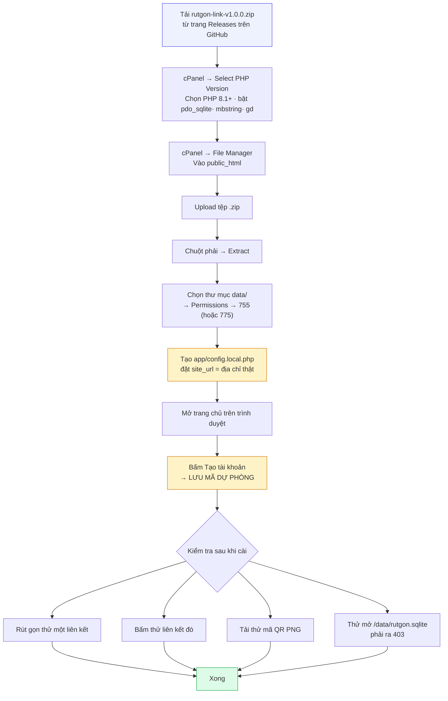
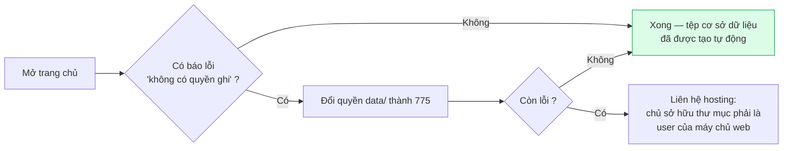
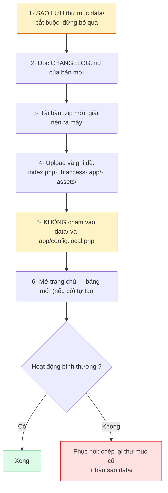

# Cài đặt trên shared hosting cPanel

Hướng dẫn từng bước để đưa hệ thống lên hosting dùng cPanel — loại hosting
phổ biến nhất ở Việt Nam. Không cần SSH, không cần Composer, không cần
MySQL.

**Thời gian:** khoảng 15 phút.

---

## Mục lục

1. [Chuẩn bị](#1-chuẩn-bị)
2. [Toàn cảnh quy trình](#2-toàn-cảnh-quy-trình)
3. [Bước 1 — Tải bản phát hành](#bước-1--tải-bản-phát-hành)
4. [Bước 2 — Kiểm tra phiên bản PHP](#bước-2--kiểm-tra-phiên-bản-php)
5. [Bước 3 — Tải tệp lên và giải nén](#bước-3--tải-tệp-lên-và-giải-nén)
6. [Bước 4 — Cấp quyền ghi cho thư mục data](#bước-4--cấp-quyền-ghi-cho-thư-mục-data)
7. [Bước 5 — Đặt địa chỉ gốc](#bước-5--đặt-địa-chỉ-gốc)
8. [Bước 6 — Tạo tài khoản quản trị](#bước-6--tạo-tài-khoản-quản-trị)
9. [Bước 7 — Kiểm tra sau khi cài](#bước-7--kiểm-tra-sau-khi-cài)
10. [Cài vào thư mục con](#cài-vào-thư-mục-con)
11. [Bật HTTPS](#bật-https)
12. [Đặt sao lưu tự động](#đặt-sao-lưu-tự-động)
13. [Nâng cấp lên bản mới](#nâng-cấp-lên-bản-mới)
14. [Xử lý sự cố khi cài đặt](#xử-lý-sự-cố-khi-cài-đặt)

---

## 1. Chuẩn bị

| Cần có | Ghi chú |
|---|---|
| Tài khoản cPanel | Của hosting hoặc do đơn vị cấp |
| Tên miền hoặc tên miền con | Ví dụ `rutgon.dongnai.edu.vn` |
| PHP 8.1 trở lên | Đổi được trong cPanel, xem Bước 2 |
| Phần mở rộng `pdo_sqlite` | Hầu hết hosting đã bật sẵn |
| Phần mở rộng `mbstring` | Hầu hết hosting đã bật sẵn |
| Phần mở rộng `gd` | Cần cho mã QR dạng PNG (SVG không cần) |

**Không cần:** MySQL, Composer, Node.js, SSH, quyền root.

---

## 2. Toàn cảnh quy trình



Hai bước tô vàng là hai bước dễ bỏ sót nhất, đọc kỹ.

---

## Bước 1 — Tải bản phát hành

Vào trang **Releases** của dự án trên GitHub, tải tệp:

```
rutgon-link-v1.0.0.zip
```

> **Đừng dùng nút "Download ZIP" ở trang chính** của repo — tệp đó chứa cả
> thư mục `tests/` và các tệp chỉ dùng khi phát triển. Bản phát hành ở trang
> Releases đã được đóng gói sẵn cho hosting.

Bản phát hành gồm:

```
index.php          Cửa vào duy nhất
.htaccess          Cấu hình Apache (đã có sẵn quy tắc chặn)
app/               Mã nguồn ứng dụng
assets/            CSS, JavaScript, biểu tượng
data/              Thư mục dữ liệu (còn trống)
docs/              Tài liệu
README.md
CHANGELOG.md
```

---

## Bước 2 — Kiểm tra phiên bản PHP

1. Đăng nhập cPanel
2. Tìm **Select PHP Version** (hoặc **MultiPHP Manager**)
3. Chọn **PHP 8.1** trở lên (nên chọn 8.2 hoặc 8.3)
4. Sang tab **Extensions**, đảm bảo các mục sau **đã tick**:

| Phần mở rộng | Vai trò |
|---|---|
| `pdo_sqlite` | **Bắt buộc** — cơ sở dữ liệu |
| `sqlite3` | **Bắt buộc** |
| `mbstring` | **Bắt buộc** — xử lý tiếng Việt |
| `gd` | Cần cho mã QR dạng PNG |
| `openssl` | Nên có |
| `curl` | Chỉ cần khi bật "tự lấy tiêu đề trang đích" |

5. Bấm **Save**

> **Cách kiểm tra nhanh:** tạo tệp `kiemtra.php` trong `public_html` với nội
> dung `<?php phpinfo();` rồi mở `ten-mien.vn/kiemtra.php`. Tìm mục
> `pdo_sqlite`. **Xoá tệp này ngay sau khi kiểm tra xong** — nó để lộ thông
> tin cấu hình máy chủ.

---

## Bước 3 — Tải tệp lên và giải nén

1. cPanel → **File Manager**
2. Vào thư mục `public_html`
   - Nếu dùng **tên miền con** (ví dụ `rutgon.dongnai.edu.vn`), vào thư mục
     tương ứng của tên miền con đó, thường là `public_html/rutgon` hoặc
     `rutgon.dongnai.edu.vn` — xem ở cPanel → **Domains**
3. Bấm **Upload**, chọn tệp `rutgon-link-v1.0.0.zip`
4. Xong thì về File Manager, **chuột phải** vào tệp zip → **Extract**
5. Giải nén vào **chính thư mục đó** (không tạo thêm thư mục con)
6. **Xoá tệp .zip** sau khi giải nén

Sau bước này, trong `public_html` phải thấy `index.php`, `app`, `assets`,
`data`.

> ⚠️ **Bật hiện tệp ẩn.** Trong File Manager, vào **Settings** (góc trên
> phải) → tick **Show Hidden Files (dotfiles)**. Tệp `.htaccess` là tệp ẩn —
> **không có nó thì liên kết rút gọn sẽ báo 404** và thư mục dữ liệu không
> được bảo vệ. Sau khi giải nén, kiểm tra `.htaccess` có nằm cùng chỗ với
> `index.php` không.

---

## Bước 4 — Cấp quyền ghi cho thư mục data

Hệ thống cần ghi được vào thư mục `data/` để tạo tệp cơ sở dữ liệu.

1. Trong File Manager, chọn thư mục **`data`**
2. Chuột phải → **Change Permissions**
3. Đặt **755**. Nếu vẫn báo lỗi không ghi được, đổi thành **775**



Tệp `data/rutgon.sqlite` được tạo **tự động** ở lần truy cập đầu tiên. Bạn
không cần tạo tay, cũng không cần import tệp SQL nào.

---

## Bước 5 — Đặt địa chỉ gốc

**Bước này rất quan trọng nếu bạn sẽ in mã QR lên văn bản.**

Nếu không đặt, hệ thống tự nhận tên miền từ trình duyệt. Nghĩa là nếu bạn vào
bằng địa chỉ tạm của hosting (ví dụ `server123.hosting.vn/~taikhoan`), mã QR
tải về sẽ chứa **địa chỉ tạm đó** — in ra 500 bản công văn là 500 bản có mã
QR chết.

Cách đặt:

1. File Manager → vào thư mục `app`
2. Bấm **+ File**, đặt tên `config.local.php`
3. Chuột phải vào tệp → **Edit**
4. Dán nội dung sau, thay tên miền cho đúng:

```php
<?php
return [
    'site_url' => 'https://rutgon.dongnai.edu.vn',
];
```

5. **Save Changes**

Vài lưu ý:

- Dùng `https://` nếu website đã có SSL (xem [Bật HTTPS](#bật-https))
- Không cần dấu `/` ở cuối, có cũng được — hệ thống tự bỏ
- Nếu cài vào thư mục con, ghi cả thư mục con:
  `'site_url' => 'https://dongnai.edu.vn/rutgon'`
- Tệp này **không bị ghi đè** khi nâng cấp bản mới

Tệp `config.local.php` cũng là nơi đổi các cấu hình khác. Xem bảng đầy đủ
trong [README](../README.md#cấu-hình). Ví dụ:

```php
<?php
return [
    'site_url' => 'https://rutgon.dongnai.edu.vn',
    'guest_hourly_limit' => 5,        // khách chỉ tạo 5 liên kết/giờ
    'code_length' => 7,               // mã tự sinh dài 7 ký tự
    'click_retention_days' => 730,    // tự xoá chi tiết lượt nhấp cũ hơn 2 năm
];
```

---

## Bước 6 — Tạo tài khoản quản trị

1. Mở địa chỉ website trên trình duyệt
2. Bấm **Tạo tài khoản**
3. Điền tên đăng nhập, họ tên, đơn vị, mật khẩu

**Tài khoản đầu tiên tự động được cấp quyền quản trị.**

### ⚠️ Lưu mã dự phòng ngay

Ngay sau khi tạo xong, hệ thống hiện **mã dự phòng** 12 ký tự dạng
`ABCD-EFGH-JKMN`. Hệ thống **không gửi email**, nên đây là cách duy nhất để
tự lấy lại mật khẩu. **Mã chỉ hiện một lần.**

Chụp ảnh hoặc ghi vào sổ ngay.

### Nên tắt tự đăng ký sau khi cài

Sau khi tạo tài khoản quản trị, vào **Quản trị → Cài đặt** và cân nhắc:

- **Tắt "Cho phép tự đăng ký"** nếu chỉ muốn cấp tài khoản có kiểm soát
- **Tắt "Cho khách rút gọn"** nếu hệ thống chỉ dùng nội bộ

---

## Bước 7 — Kiểm tra sau khi cài

Làm đủ 6 mục này trước khi thông báo cho các đơn vị dùng:

| # | Việc kiểm tra | Kết quả đúng |
|---|---|---|
| 1 | Mở trang chủ | Hiện trang, không lỗi |
| 2 | Rút gọn một liên kết thử, đặt tên `kiem-tra` | Ra trang kết quả |
| 3 | Bấm vào liên kết `ten-mien.vn/kiem-tra` | Chuyển đúng tới đích |
| 4 | Vào **Mã QR** → **Tải ảnh PNG** | Tải được tệp .png |
| 5 | Quét mã QR bằng điện thoại | Mở đúng trang đích |
| 6 | Mở `ten-mien.vn/data/rutgon.sqlite` | **Phải báo 403 Forbidden** |

**Mục 6 là mục an ninh quan trọng nhất.** Nếu nó tải về tệp cơ sở dữ liệu thay
vì báo 403, nghĩa là `.htaccess` chưa hoạt động — toàn bộ dữ liệu người dùng
đang bị lộ. Xem [Xử lý sự cố](#xử-lý-sự-cố-khi-cài-đặt).

Kiểm tra thêm ba địa chỉ này, cả ba **phải ra 403**:

```
ten-mien.vn/app/config.php
ten-mien.vn/data/
ten-mien.vn/README.md
```

Xong phần kiểm tra, nhớ **xoá liên kết thử** `kiem-tra`.

---

## Cài vào thư mục con

Hệ thống chạy được khi đặt trong thư mục con, ví dụ
`https://dongnai.edu.vn/rutgon/`.

1. Giải nén vào `public_html/rutgon`
2. Đặt `site_url` **có cả thư mục con**:

```php
<?php
return ['site_url' => 'https://dongnai.edu.vn/rutgon'];
```

Liên kết rút gọn sẽ có dạng `dongnai.edu.vn/rutgon/tuyen-sinh-10`.

> Liên kết dài hơn một chút. Nếu định in mã QR nhiều, nên xin **tên miền
> con riêng** (`rutgon.dongnai.edu.vn`) để liên kết ngắn gọn hơn.

---

## Bật HTTPS

Nên bật trước khi phát liên kết ra ngoài.

1. cPanel → **SSL/TLS Status** (hoặc **Let's Encrypt SSL**)
2. Chọn tên miền → **Run AutoSSL** / **Issue**
3. Chờ vài phút cho chứng thư được cấp
4. Sửa `app/config.local.php`, đổi `http://` thành `https://`
5. (Nên làm) Buộc chuyển sang HTTPS: thêm vào **đầu** tệp `.htaccess`, ngay
   sau dòng `RewriteEngine On`:

```apache
    # Buộc dùng HTTPS
    RewriteCond %{HTTPS} off
    RewriteRule ^(.*)$ https://%{HTTP_HOST}%{REQUEST_URI} [L,R=301]
```

> Đặt sau `RewriteEngine On` và **trước** quy tắc chặn `(data|app|tests|tools)`.

---

## Đặt sao lưu tự động

Toàn bộ dữ liệu nằm trong một tệp, nên sao lưu rất đơn giản.

### Cách 1 — Sao lưu tay (nhanh nhất)

1. File Manager → chọn thư mục `data`
2. Chuột phải → **Compress** → **Zip Archive**
3. Tải tệp .zip về máy, đặt tên theo ngày: `data-2026-09-07.zip`

Nên làm mỗi tuần, và **trước mỗi lần nâng cấp**.

### Cách 2 — Cron Job (tự động)

cPanel → **Cron Jobs**, thêm công việc chạy hằng ngày:

```bash
mkdir -p ~/backups && cp ~/public_html/data/rutgon.sqlite ~/backups/rutgon-$(date +\%F).sqlite && find ~/backups -name 'rutgon-*.sqlite' -mtime +30 -delete
```

Lệnh này chép tệp cơ sở dữ liệu vào `~/backups` mỗi ngày và tự xoá bản cũ
hơn 30 ngày.

> Nếu hosting có sẵn `sqlite3`, dùng lệnh này chính xác hơn (chép đúng cả khi
> hệ thống đang có người dùng):
> ```bash
> sqlite3 ~/public_html/data/rutgon.sqlite ".backup '$HOME/backups/rutgon-$(date +\%F).sqlite'"
> ```

### Cách 3 — Backup của cPanel

cPanel → **Backup** → **Download a Home Directory Backup**. Cách này sao lưu
toàn bộ, gồm cả cơ sở dữ liệu.

> Trong cron, dấu `%` phải viết là `\%` — đây là quy định của cPanel.

---

## Nâng cấp lên bản mới



Cách an toàn nhất trên cPanel:

1. Sao lưu `data/` (xem mục trên)
2. Đổi tên thư mục hiện tại: `rutgon` → `rutgon-cu`
3. Giải nén bản mới vào `rutgon`
4. Chép `rutgon-cu/data/` và `rutgon-cu/app/config.local.php` sang `rutgon/`
5. Kiểm tra hoạt động
6. Xong thì xoá `rutgon-cu`

Nếu có vấn đề, chỉ cần đổi tên ngược lại là về nguyên trạng.

---

## Xử lý sự cố khi cài đặt

<details>
<summary><b>Trang chủ chạy, nhưng liên kết rút gọn báo 404</b></summary>

Nguyên nhân: `.htaccess` không được đọc, hoặc `mod_rewrite` chưa bật.

Cách xử lý:

1. Kiểm tra tệp `.htaccess` **có tồn tại** cùng chỗ với `index.php` (bật
   *Show Hidden Files* trong File Manager)
2. Thử mở `ten-mien.vn/index.php/kiem-tra`. Nếu **cách này chạy được** thì
   đúng là vấn đề rewrite
3. Liên hệ hosting yêu cầu bật `mod_rewrite` và đặt `AllowOverride All`
4. Tạm thời vẫn dùng được với đường dẫn dạng `/index.php/ten-tuy-chon` — nhớ
   đặt `site_url` để liên kết sinh ra đúng dạng đó
</details>

<details>
<summary><b>Mở /data/rutgon.sqlite lại tải về được tệp — NGUY HIỂM</b></summary>

`.htaccess` không hoạt động. Toàn bộ dữ liệu người dùng đang bị lộ. Xử lý ngay:

1. Kiểm tra `.htaccess` có tồn tại trong thư mục gốc và trong `data/`
2. Yêu cầu hosting đặt `AllowOverride All` cho thư mục
3. **Trong lúc chờ:** đổi vị trí tệp cơ sở dữ liệu ra ngoài `public_html` —
   sửa `app/config.local.php`:
   ```php
   <?php
   return [
       'site_url' => 'https://rutgon.dongnai.edu.vn',
       'db_path'  => '/home/TEN_TAI_KHOAN/rutgon-data/rutgon.sqlite',
   ];
   ```
   Tạo thư mục `rutgon-data` **ngang hàng** với `public_html` (không nằm
   trong), cấp quyền 755, rồi chép tệp `.sqlite` sang. Nằm ngoài
   `public_html` thì web không thể truy cập được, dù `.htaccess` có hoạt
   động hay không.
</details>

<details>
<summary><b>Trang trắng, không thông báo gì</b></summary>

Có lỗi PHP nhưng hệ thống không hiện chi tiết ra ngoài (đúng như thiết kế).

1. Mở tệp `data/error.log` bằng File Manager → **Edit** để xem lỗi
2. Kiểm tra phiên bản PHP có phải 8.1+ (Bước 2)
3. Kiểm tra `pdo_sqlite` và `mbstring` đã bật
4. Xem cả **Errors** trong cPanel (mục **Metrics → Errors**)
</details>

<details>
<summary><b>"Thư mục dữ liệu không có quyền ghi"</b></summary>

1. Đặt quyền thư mục `data` = **755**, nếu chưa được thì **775**
2. Nếu vẫn lỗi: chủ sở hữu thư mục không phải user của máy chủ web. Liên hệ
   hosting, hoặc thử xoá thư mục `data` rồi tạo lại bằng File Manager (thư
   mục do bạn tạo sẽ có chủ sở hữu đúng)
</details>

<details>
<summary><b>Tải được SVG nhưng không tải được PNG</b></summary>

Thiếu phần mở rộng `gd`. Vào cPanel → **Select PHP Version** → **Extensions**
→ tick `gd` → **Save**.

SVG vẫn dùng bình thường trong lúc chờ, và SVG thậm chí tốt hơn khi in khổ lớn.
</details>

<details>
<summary><b>Liên kết và mã QR ra sai tên miền</b></summary>

Chưa đặt `site_url`. Xem [Bước 5](#bước-5--đặt-địa-chỉ-gốc).

Nếu đã in mã QR sai tên miền ra giấy: đặt `site_url` cho đúng, rồi **trỏ tên
miền cũ về cùng máy chủ** này. Hệ thống chấp nhận truy cập từ mọi tên miền
trỏ tới nó, nên các mã QR đã in vẫn hoạt động.
</details>

<details>
<summary><b>Tiếng Việt hiện thành dấu hỏi hoặc ô vuông</b></summary>

Thiếu `mbstring`. Bật trong cPanel → **Select PHP Version** → **Extensions**.
</details>

<details>
<summary><b>Tệp CSV xuất ra mở bằng Excel bị lỗi font</b></summary>

Tệp đã có BOM UTF-8 nên Excel bản mới đọc đúng. Nếu vẫn lỗi: mở Excel →
**Data** → **From Text/CSV** → chọn encoding **UTF-8** → **Load**.
</details>

<details>
<summary><b>Hosting giới hạn dung lượng — tệp dữ liệu to dần</b></summary>

Mỗi lượt nhấp là một dòng trong bảng `clicks`. Một triệu lượt nhấp khoảng
150–200 MB.

Xử lý: **Quản trị → Cài đặt → Bảo trì**:
1. **Xoá chi tiết lượt nhấp cũ** hơn N ngày (số tổng hợp của từng liên kết
   vẫn giữ nguyên)
2. **Dồn nén cơ sở dữ liệu** để thu nhỏ tệp

Hoặc đặt tự động trong `app/config.local.php`:
```php
'click_retention_days' => 365,   // chỉ giữ chi tiết 1 năm
```
</details>

---

## Danh sách kiểm tra khi bàn giao

Sao chép danh sách này để tick khi triển khai:

- [ ] PHP 8.1+ đã chọn, có `pdo_sqlite`, `mbstring`, `gd`
- [ ] Đã giải nén đúng thư mục, `.htaccess` nằm cùng `index.php`
- [ ] Thư mục `data/` có quyền ghi
- [ ] Đã tạo `app/config.local.php` với `site_url` đúng tên miền
- [ ] Đã bật HTTPS và buộc chuyển sang HTTPS
- [ ] Đã tạo tài khoản quản trị và **lưu mã dự phòng**
- [ ] Đã tắt tự đăng ký (nếu chỉ cấp tài khoản có kiểm soát)
- [ ] `/data/rutgon.sqlite` trả về **403**
- [ ] `/app/config.php` trả về **403**
- [ ] Rút gọn thử → bấm thử → tải mã QR → quét thử: đều đúng
- [ ] Đã đặt sao lưu định kỳ
- [ ] Đã xoá liên kết thử và tệp `kiemtra.php` (nếu có tạo)

---

© 2026 — **Thiết kế bởi Trương Anh Tuấn** · Phòng GDPT-GDTX Sở GDĐT Đồng Nai
