# Hướng dẫn sử dụng

Tài liệu dành cho cán bộ, giáo viên và nhân viên các đơn vị trực thuộc
**Sở GDĐT Đồng Nai**. Không cần biết về kỹ thuật.

> Người quản trị hệ thống xem thêm [Quy trình kỹ thuật](quy-trinh-ky-thuat.md)
> và [Cài đặt trên cPanel](cai-dat-cpanel.md).

---

## Mục lục

1. [Hệ thống này để làm gì?](#1-hệ-thống-này-để-làm-gì)
2. [Rút gọn liên kết trong 30 giây](#2-rút-gọn-liên-kết-trong-30-giây)
3. [Đặt tên tuỳ chọn](#3-đặt-tên-tuỳ-chọn)
4. [Tạo tài khoản](#4-tạo-tài-khoản)
5. [Bảng điều khiển](#5-bảng-điều-khiển)
6. [Quản lý liên kết](#6-quản-lý-liên-kết)
7. [Mã QR — tạo và in](#7-mã-qr--tạo-và-in)
8. [Đọc số liệu thống kê](#8-đọc-số-liệu-thống-kê)
9. [Bảo vệ và hẹn giờ liên kết](#9-bảo-vệ-và-hẹn-giờ-liên-kết)
10. [Tạo nhiều liên kết một lượt](#10-tạo-nhiều-liên-kết-một-lượt)
11. [Công cụ gắn thẻ UTM](#11-công-cụ-gắn-thẻ-utm)
12. [Tài khoản của tôi](#12-tài-khoản-của-tôi)
13. [Dành cho quản trị viên](#13-dành-cho-quản-trị-viên)
14. [Câu hỏi thường gặp](#14-câu-hỏi-thường-gặp)
15. [Mẹo dùng cho công việc ở Sở](#15-mẹo-dùng-cho-công-việc-ở-sở)

---

## 1. Hệ thống này để làm gì?

Biến một địa chỉ dài dòng thành liên kết ngắn, dễ đọc, **tự đặt tên được**,
kèm **mã QR** để in lên văn bản và **số liệu** để biết thông báo đã tới được
bao nhiêu người.

| Trước | Sau |
|---|---|
| `https://sgddt.dongnai.gov.vn/thong-bao/tuyen-sinh-lop-10-nam-hoc-2026-2027.pdf` | `rutgon.dongnai.edu.vn/tuyen-sinh-10` |

Ba lợi ích thực tế:

- **Đọc qua điện thoại được.** Không phải đánh vần một dãy ký tự dài.
- **In lên công văn được.** Ngắn, kèm mã QR để người nhận quét là mở ngay.
- **Sửa được đích đến.** Tài liệu ra bản mới thì chỉ cần trỏ lại, **không
  phải in lại văn bản**.

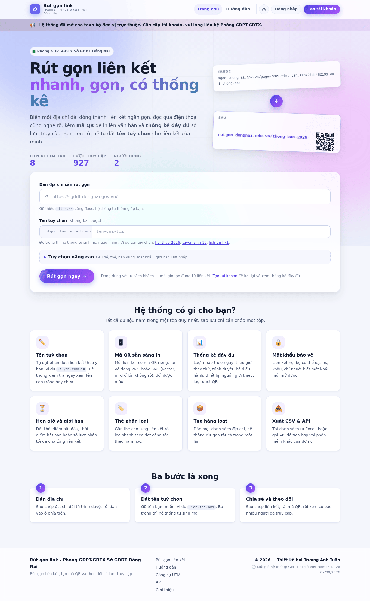

---

## 2. Rút gọn liên kết trong 30 giây

Không cần đăng nhập vẫn dùng được.

**Bước 1.** Mở trang chủ, dán địa chỉ dài vào ô **"Dán địa chỉ cần rút gọn"**.

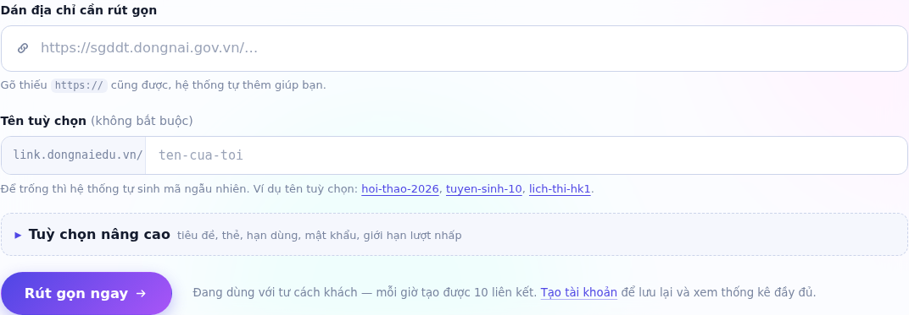

> Gõ thiếu `https://` cũng được — hệ thống tự thêm giúp bạn.

**Bước 2.** (Không bắt buộc) Gõ **tên tuỳ chọn** bạn muốn.

**Bước 3.** Bấm **Rút gọn ngay**.

Trang kết quả hiện liên kết ngắn, mã QR và các nút chia sẻ. Bấm
**Sao chép** là xong.

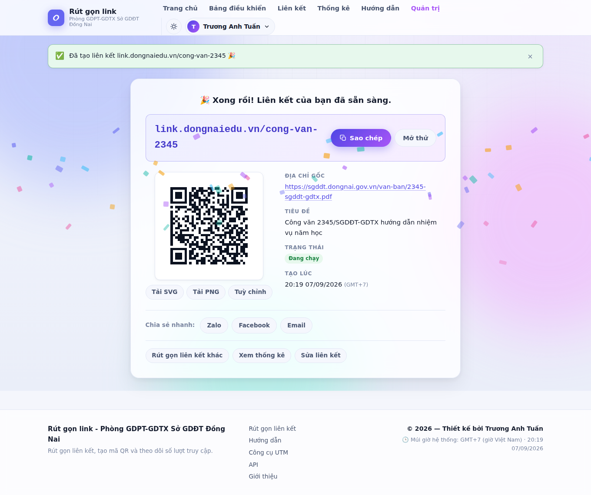

Trên trang này bạn có thể:

| Nút | Tác dụng |
|---|---|
| **Sao chép** | Chép liên kết vào bộ nhớ tạm, dán vào văn bản hay tin nhắn |
| **Mở thử** | Kiểm tra liên kết dẫn đúng chỗ chưa |
| **Tải SVG** | Ảnh vector — dùng khi in băng-rôn, pa-nô, standee khổ lớn |
| **Tải PNG** | Ảnh thường — chèn vào Word, gửi Zalo |
| **Tuỳ chỉnh** | Đổi màu, kích thước mã QR |
| **Zalo / Facebook / Email** | Chia sẻ nhanh |

> 💡 **Nên đăng nhập.** Khi đã đăng nhập, liên kết được lưu vào danh sách của
> bạn, **sửa được về sau** và **xem được thống kê đầy đủ**. Dùng với tư cách
> khách thì mỗi giờ chỉ tạo được 10 liên kết và không xem được thống kê.

---

## 3. Đặt tên tuỳ chọn

Đây là tính năng đáng dùng nhất. Thay vì để hệ thống sinh mã ngẫu nhiên như
`rutgon.dongnai.edu.vn/k7Bq2x`, bạn tự đặt tên cho dễ nhớ:

- `rutgon.dongnai.edu.vn/tuyen-sinh-10`
- `rutgon.dongnai.edu.vn/lich-thi-hk1`
- `rutgon.dongnai.edu.vn/bieu-mau-2026`

Hệ thống **kiểm tra ngay khi bạn gõ**. Tên còn trống thì hiện dấu xanh:

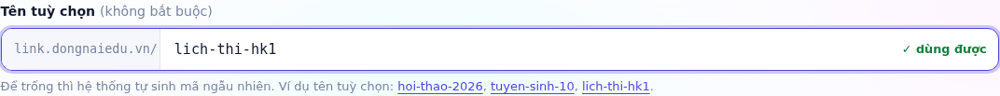

Tên đã có người dùng thì hiện dấu đỏ **kèm gợi ý tên khác** — bấm vào gợi ý
là điền luôn:

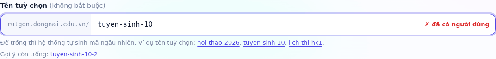

### Quy tắc đặt tên

| Quy tắc | Ví dụ đúng | Ví dụ sai |
|---|---|---|
| Dài 3–64 ký tự | `lich-thi` | `ab` (quá ngắn) |
| Chữ **không dấu**, số, và `-` `_` `.` | `tuyen-sinh-2026` | `tuyển-sinh` (có dấu) |
| Bắt đầu và kết thúc bằng chữ hoặc số | `bieu-mau-01` | `-bieu-mau-` |
| Không hai dấu liền nhau | `de-thi` | `de--thi` |
| Không trùng đường dẫn hệ thống | `thong-ke-truong` | `thong-ke` (bị giữ) |

Tên **không phân biệt chữ hoa chữ thường**: `/Tuyen-Sinh` và `/tuyen-sinh`
mở ra cùng một chỗ. Người nhận gõ kiểu nào cũng đúng.

### Cách đặt tên nên theo

Đặt theo mẫu **chủ-đề + năm** để năm sau dễ tạo tên mới mà không trùng:

| Việc | Tên nên đặt |
|---|---|
| Thông báo tuyển sinh | `tuyen-sinh-2026`, `tuyen-sinh-2027` |
| Lịch công tác tháng | `lich-cong-tac-t9`, `lich-cong-tac-t10` |
| Công văn | `cv-1234`, `cv-2345` (theo số công văn) |
| Biểu mẫu báo cáo | `bieu-mau-hk1`, `bieu-mau-hk2` |
| Tài liệu tập huấn | `tap-huan-nls`, `tap-huan-cntt` |

---

## 4. Tạo tài khoản

Vào **Tạo tài khoản** ở đầu trang. Chỉ cần tên đăng nhập và mật khẩu; họ tên
và đơn vị nên điền để quản trị viên biết ai là ai.

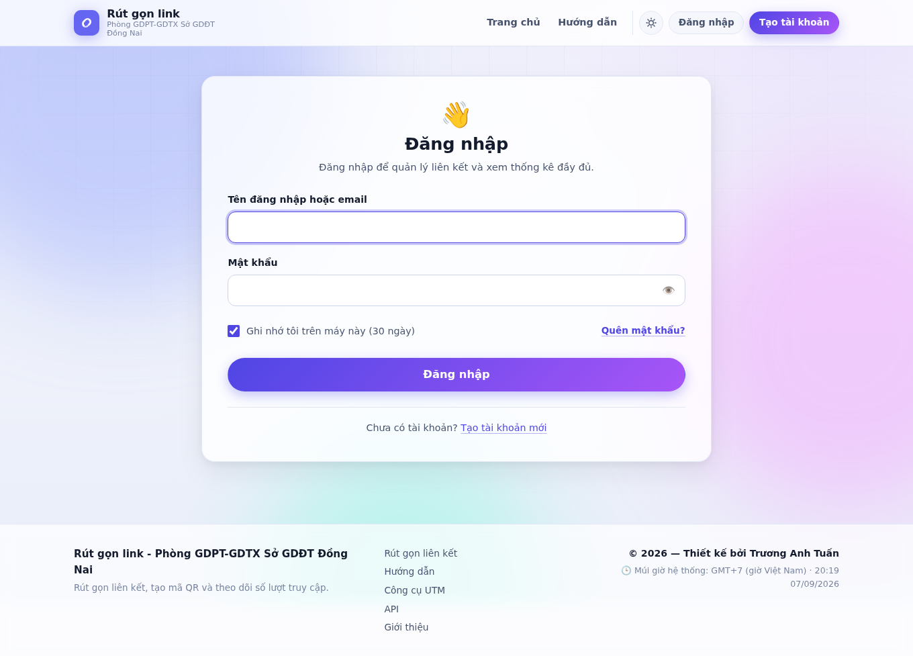

### ⚠️ Mã dự phòng — đọc kỹ phần này

Ngay sau khi tạo tài khoản, hệ thống hiện một **mã dự phòng** gồm 12 ký tự,
dạng `ABCD-EFGH-JKMN`.

**Hệ thống không gửi email**, nên đây là cách duy nhất để bạn **tự lấy lại
mật khẩu** khi quên. Mã này **chỉ hiện đúng một lần**.

👉 **Hãy chụp ảnh hoặc ghi vào sổ ngay.**

Nếu mất luôn mã dự phòng, vẫn còn cách: nhờ **quản trị viên đặt lại mật khẩu**
giúp bạn.

---

## 5. Bảng điều khiển

Sau khi đăng nhập, đây là trang tổng quan.

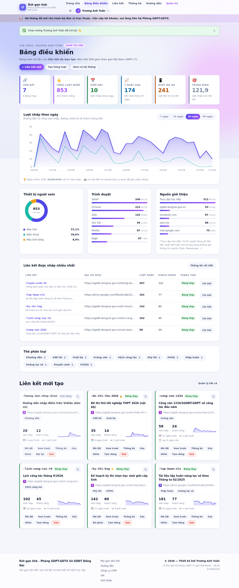

Sáu ô số liệu ở trên:

| Ô | Nghĩa |
|---|---|
| **Liên kết** | Tổng số liên kết bạn đã tạo / số đang chạy |
| **Tổng lượt nhấp** | Mọi lần có người mở liên kết của bạn |
| **Hôm nay** | Số lượt trong ngày hôm nay (giờ Việt Nam) |
| **7 ngày qua** | Số lượt trong tuần |
| **Quét mã QR** | Số lượt đến từ việc quét mã QR |
| **Trung bình** | Số lượt nhấp trung bình mỗi liên kết |

Bên dưới là biểu đồ theo ngày (đổi được 7 / 14 / 30 / 90 ngày), thiết bị
người xem, trình duyệt, nguồn giới thiệu, và danh sách liên kết mới tạo.

---

## 6. Quản lý liên kết

Vào **Liên kết** trên thanh menu.

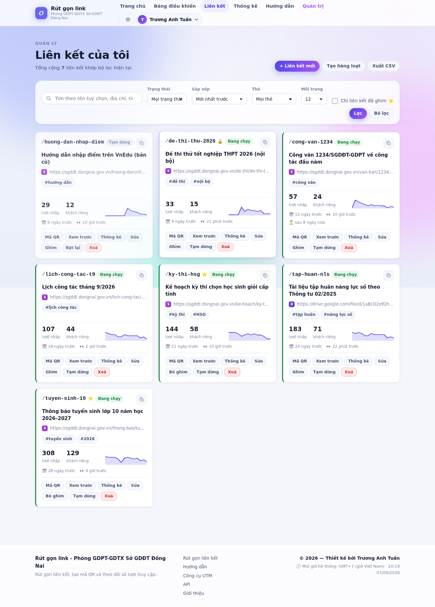

### Thẻ liên kết

Mỗi liên kết là một thẻ, có đủ thông tin và nút thao tác:

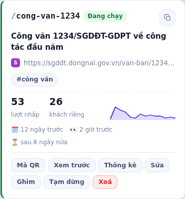

| Ký hiệu | Nghĩa |
|---|---|
| ⭐ | Liên kết đã ghim (quan trọng) |
| 🔒 | Có mật khẩu bảo vệ |
| **Đang chạy** (xanh) | Hoạt động bình thường |
| **Tạm dừng** (xám) | Đã tắt, người mở thấy thông báo |
| **Hết hạn** (đỏ) | Đã quá thời điểm hết hạn |
| **Chờ tới hạn** (xanh dương) | Chưa tới giờ bắt đầu |
| **Đủ lượt** (vàng) | Đã dùng hết số lượt cho phép |

### Tìm và lọc

Thanh lọc phía trên cho phép:

- **Tìm** theo tên tuỳ chọn, địa chỉ, tiêu đề, ghi chú, thẻ
- **Lọc** theo trạng thái (đang chạy, tạm dừng, hết hạn, có mật khẩu…)
- **Sắp xếp** theo mới nhất, nhiều lượt nhấp nhất, vừa được nhấp…
- **Lọc theo thẻ** phân loại
- **Chỉ liên kết đã ghim**

Bấm **Xuất CSV** để tải danh sách đang lọc ra tệp mở được bằng Excel (đã có
BOM UTF-8 nên tiếng Việt không bị lỗi font).

### Biểu mẫu đầy đủ

Bấm **+ Liên kết mới** để mở biểu mẫu có tất cả tuỳ chọn:

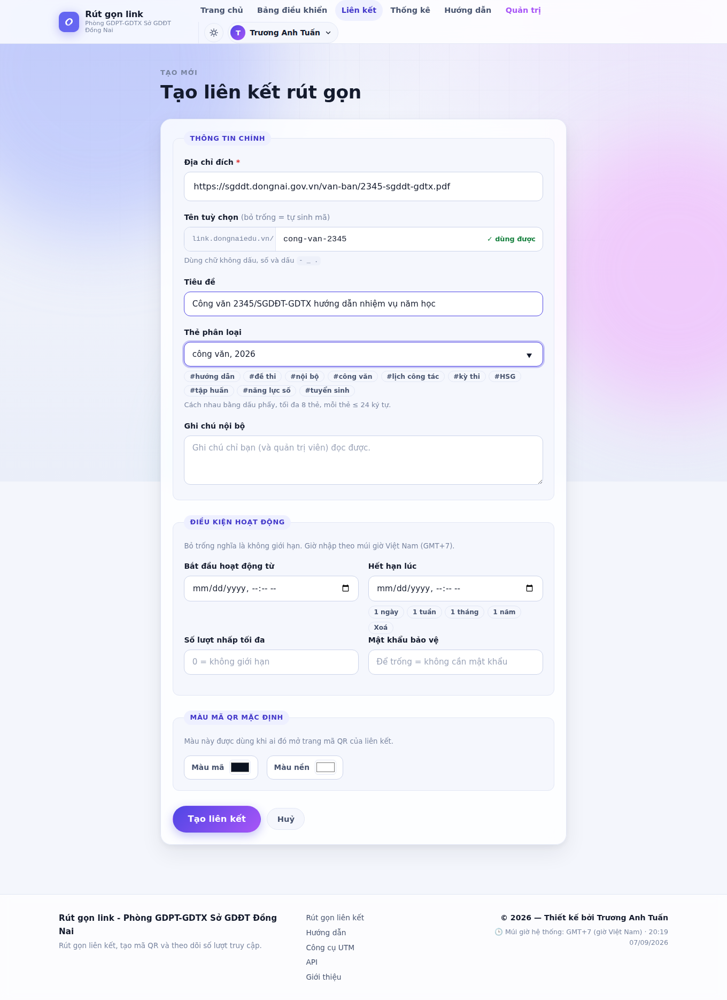

| Mục | Dùng để làm gì |
|---|---|
| **Địa chỉ đích** | Nơi liên kết dẫn tới |
| **Tên tuỳ chọn** | Phần đuôi liên kết bạn tự đặt |
| **Tiêu đề** | Tên gợi nhớ, chỉ để bạn dễ tìm |
| **Thẻ phân loại** | Gắn nhãn để lọc nhanh (tối đa 8 thẻ) |
| **Ghi chú nội bộ** | Chỉ bạn và quản trị viên đọc được |
| **Bắt đầu / Hết hạn** | Hẹn giờ hoạt động |
| **Số lượt nhấp tối đa** | Giới hạn số người mở được |
| **Mật khẩu bảo vệ** | Người nhận phải nhập mật khẩu |
| **Màu mã QR** | Màu mặc định khi tạo mã QR cho liên kết này |

### Sửa liên kết mà giữ nguyên địa chỉ ngắn

Đây là điểm mạnh nhất khi in ấn: vào **Sửa** rồi thay **Địa chỉ đích**. Liên
kết ngắn và mã QR đã in ra **vẫn dùng bình thường**.

> **Ví dụ:** Công văn đã in 500 bản, có mã QR trỏ tới `cv-1234`. Sau đó tài
> liệu được cập nhật sang bản mới. Bạn chỉ cần sửa địa chỉ đích của `cv-1234`
> — 500 bản đã phát vẫn quét ra tài liệu mới nhất.

> ⚠️ **Đừng đổi *tên tuỳ chọn*** sau khi đã in. Tên cũ sẽ ngừng hoạt động và
> mọi bản in, mã QR đã phát hành thành liên kết chết. Cần tên mới thì **tạo
> thêm** một liên kết, giữ nguyên liên kết cũ.

### Trang xem trước

Thêm `/xem/` trước tên bất kỳ để xem liên kết dẫn tới đâu **mà không tính
vào lượt nhấp**:

```
rutgon.dongnai.edu.vn/xem/tuyen-sinh-10
```

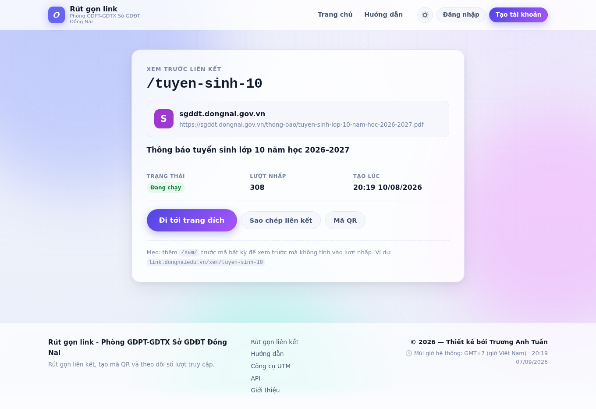

Hữu ích khi bạn muốn kiểm tra liên kết của người khác trước khi bấm, hoặc
muốn kiểm tra liên kết của mình mà không làm sai số liệu.

---

## 7. Mã QR — tạo và in

Mỗi liên kết đã có mã QR riêng, không cần tạo thêm bước nào. Bấm **Mã QR**
ở thẻ liên kết.

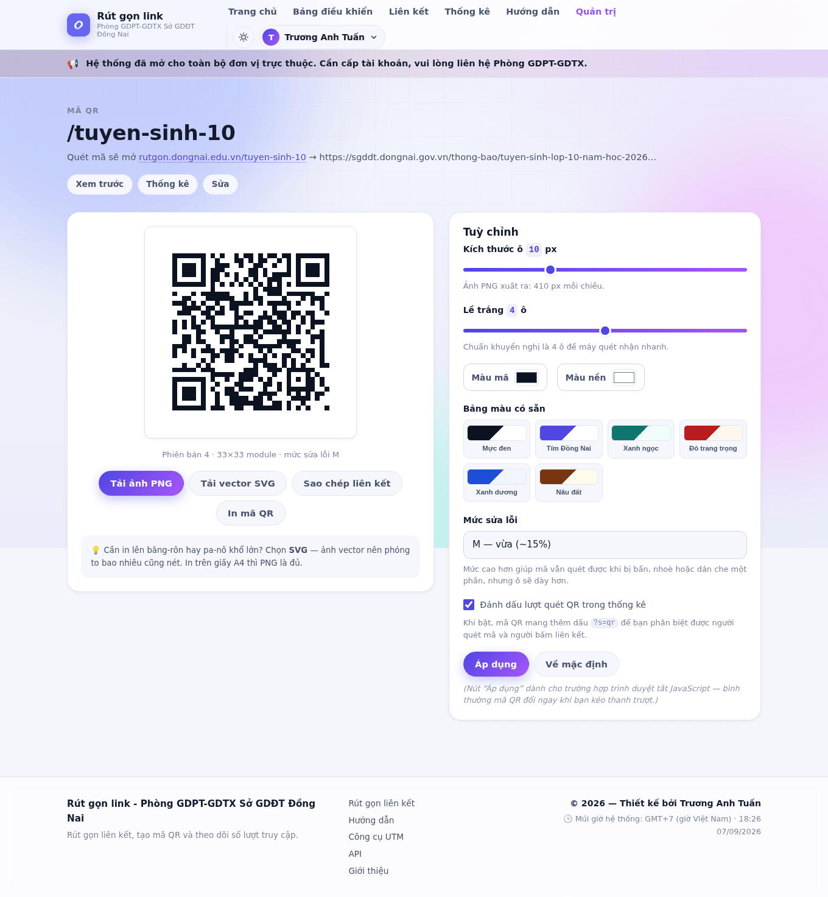

### Chọn PNG hay SVG?

| Định dạng | Dùng khi | Lý do |
|---|---|---|
| **PNG** | Chèn Word, gửi Zalo, in giấy A4 | Ảnh thường, dán vào đâu cũng được |
| **SVG** | Băng-rôn, pa-nô, standee, backdrop | Ảnh **vector** — phóng to bao nhiêu cũng nét, không bị rỗ |

### Tuỳ chỉnh

Kéo thanh trượt là mã QR đổi ngay:

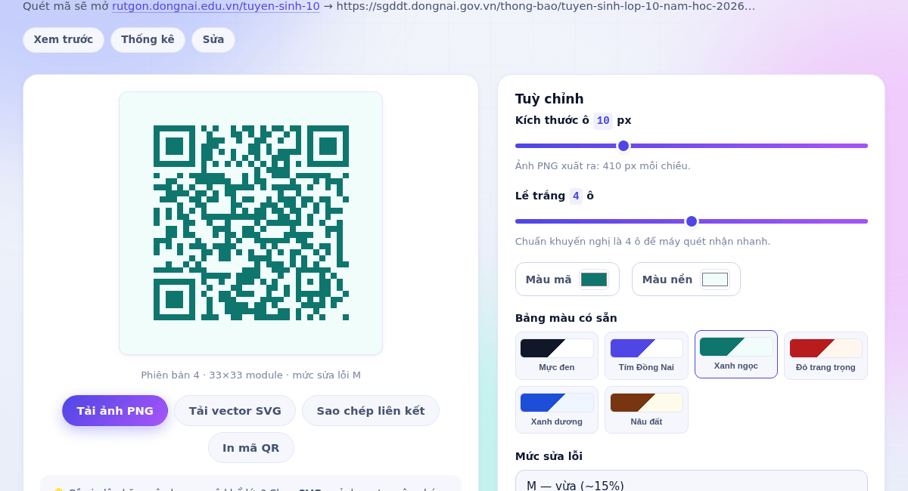

| Mục | Ý nghĩa |
|---|---|
| **Kích thước ô** | Ô càng lớn, ảnh PNG càng lớn (hiện sẵn số px kết quả) |
| **Lề trắng** | Khoảng trắng quanh mã. **Nên để 4 ô** — máy quét cần lề để nhận |
| **Màu mã / Màu nền** | Chọn màu tự do, hoặc dùng bảng màu có sẵn |
| **Mức sửa lỗi** | Xem bảng dưới |

### Chọn mức sửa lỗi nào?

Mã QR có khả năng tự sửa lỗi — bị bẩn, nhoè hay che một phần vẫn quét được.

| Mức | Chịu hư hỏng | Nên dùng khi |
|---|---|---|
| **L** | ~7% | Mã chỉ hiện trên màn hình |
| **M** | ~15% | **Mặc định** — in giấy, dán trong nhà |
| **Q** | ~25% | Dán nơi hay bị chạm, cọ xước |
| **H** | ~30% | Ngoài trời, in mờ, hoặc bị che một phần |

Mức càng cao thì ô càng dày (mã trông "rậm" hơn) nhưng bền hơn.

### Lưu ý khi in

- **In tối thiểu 2×2 cm** cho khổ giấy A4 để điện thoại quét được từ khoảng
  20–30 cm.
- **Giữ lề trắng.** Đừng cắt sát hay đặt mã sát mép giấy.
- **Tương phản cao.** Mã màu đậm trên nền sáng. Tránh mã sáng trên nền đậm.
- **In thử và quét thử** trước khi in số lượng lớn.
- Bấm **In mã QR** để in riêng mã ra giấy.

---

## 8. Đọc số liệu thống kê

Vào **Thống kê** để xem toàn cảnh, hoặc bấm **Thống kê** ở từng liên kết.

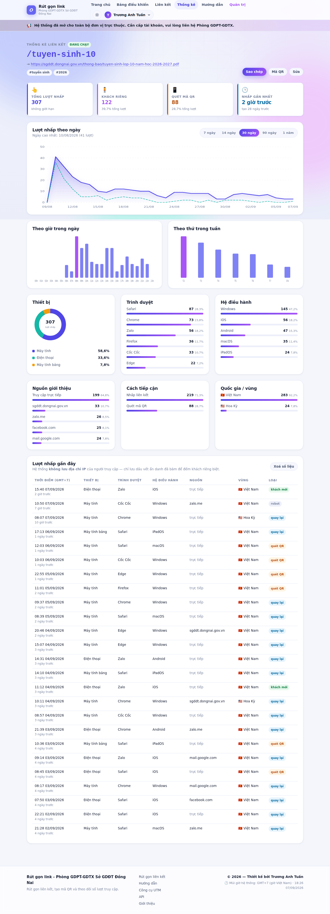

### Các con số nghĩa là gì

| Chỉ số | Nghĩa |
|---|---|
| **Tổng lượt nhấp** | Mỗi lần có người mở liên kết là một lượt, **kể cả cùng một người mở nhiều lần** |
| **Khách riêng** | Số người khác nhau. Đếm theo dấu vết ẩn danh, không phải theo IP |
| **Quét mã QR** | Số lượt đến từ việc quét mã QR do hệ thống sinh ra |
| **Nhấp gần nhất** | Lần cuối có người mở liên kết |
| **Robot** | Lượt do máy quét tự động (Zalo, Facebook kiểm tra liên kết…) |

### Biểu đồ theo ngày

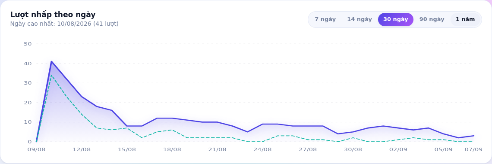

- **Đường đậm** = tổng lượt nhấp
- **Đường mảnh nét đứt** = số khách riêng biệt

Đưa chuột lên từng điểm để xem số cụ thể của ngày đó. Đổi khoảng thời gian
bằng các nút 7 / 14 / 30 / 90 ngày / 1 năm.

### Theo giờ và theo thứ

Hai biểu đồ này cho biết **giờ nào và thứ nào người xem đông nhất** — dùng để
chọn thời điểm gửi thông báo. Thường sẽ thấy giờ hành chính và đầu tuần cao
hơn hẳn.

### Nguồn giới thiệu

Cho biết người xem đến từ đâu. Ghi **"Truy cập trực tiếp"** khi người dùng:

- Gõ liên kết bằng tay
- Quét mã QR
- Mở từ ứng dụng không gửi thông tin nguồn (Zalo, Messenger, phần mềm đọc email)

Đây là trường hợp phổ biến nhất trong công việc ở Sở, nên đừng lo khi thấy
tỉ lệ này cao.

### Lượt nhấp gần đây

Bảng cuối trang liệt kê từng lượt nhấp: thời điểm, thiết bị, trình duyệt, hệ
điều hành, nguồn, vùng, và loại (khách mới / quay lại / quét QR / robot).

> 🔒 **Về quyền riêng tư:** hệ thống **không lưu địa chỉ IP** của người truy
> cập. IP chỉ được dùng ngay tại thời điểm đó để tính một mã băm ẩn danh
> (không thể suy ngược) nhằm phân biệt khách riêng biệt.

### Thống kê tổng hợp

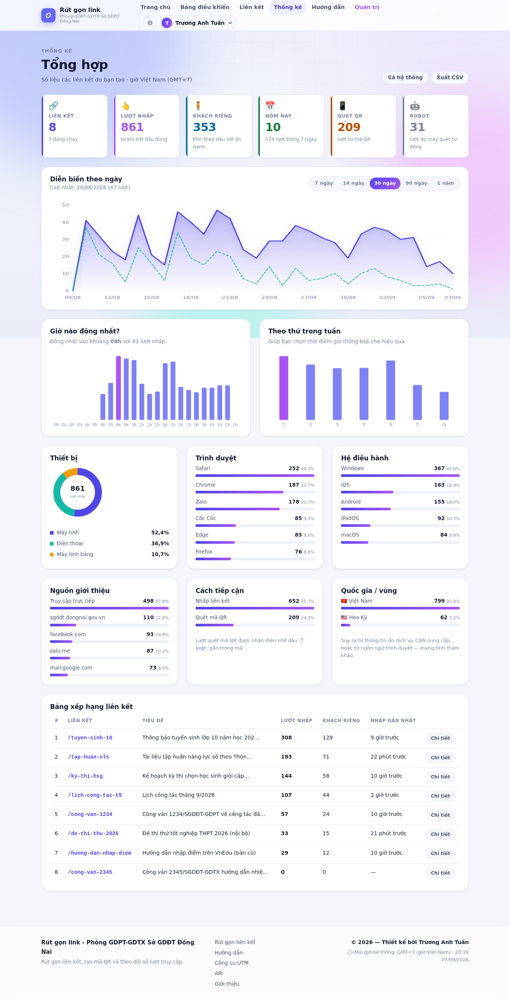

Trang này gộp số liệu của mọi liên kết bạn tạo, kèm bảng xếp hạng liên kết
nào được nhấp nhiều nhất.

> Mọi mốc thời gian trong hệ thống đều theo **giờ Việt Nam (GMT+7)**, kể cả
> biểu đồ theo giờ và theo thứ.

---

## 9. Bảo vệ và hẹn giờ liên kết

Trong biểu mẫu tạo/sửa liên kết, mục **Điều kiện hoạt động** có bốn công cụ.

### Mật khẩu bảo vệ

Người nhận phải nhập mật khẩu mới mở được:

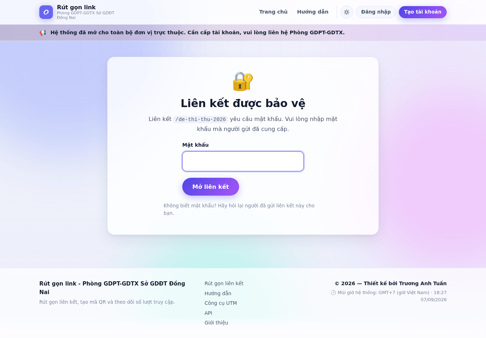

Trang này **không để lộ địa chỉ đích** — người không biết mật khẩu không biết
liên kết dẫn tới đâu. Dùng cho tài liệu nội bộ, đề thi, danh sách cá nhân.

### Hẹn giờ bắt đầu

Trước giờ đó, người mở thấy thông báo "chưa tới giờ". Tiện khi cần công bố
tài liệu **đúng thời điểm** — chuẩn bị và phát liên kết trước, tài liệu tự
mở đúng giờ.

### Hết hạn lúc

Sau giờ đó liên kết tự ngừng, **không cần bạn vào tắt**. Có các nút nhanh
1 ngày / 1 tuần / 1 tháng / 1 năm.

### Số lượt nhấp tối đa

Ví dụ chỉ cho 100 người đầu tiên tải biểu mẫu.

### Tạm dừng và bật lại

Ở thẻ liên kết, bấm **Tạm dừng** để ngừng tạm thời. Người mở sẽ thấy:

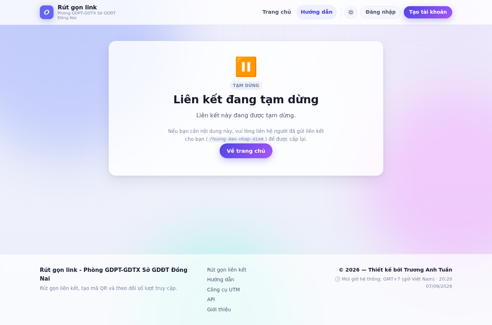

Bấm **Bật lại** là hoạt động tiếp, **số liệu thống kê đã có không mất**.

> Nên dùng **Tạm dừng** thay vì **Xoá**. Xoá là mất luôn cả số liệu và không
> lấy lại được.

---

## 10. Tạo nhiều liên kết một lượt

Vào **Tạo hàng loạt**, dán danh sách — mỗi dòng một địa chỉ:

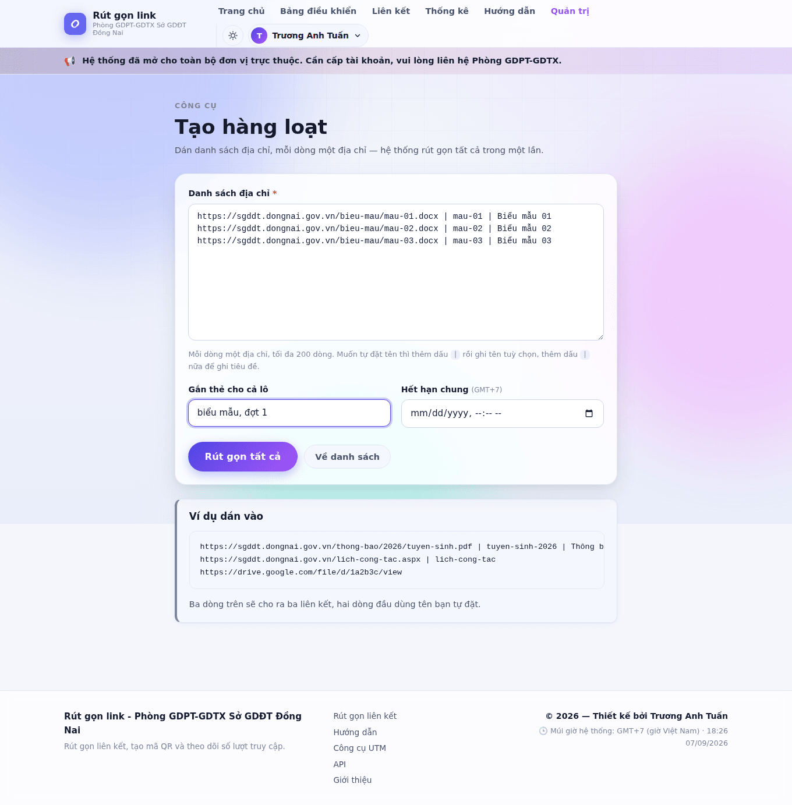

Cú pháp mỗi dòng:

```
địa-chỉ
địa-chỉ | tên-tuỳ-chọn
địa-chỉ | tên-tuỳ-chọn | Tiêu đề
```

Ví dụ:

```
https://sgddt.dongnai.gov.vn/bieu-mau/mau-01.docx | mau-01 | Biểu mẫu 01
https://sgddt.dongnai.gov.vn/bieu-mau/mau-02.docx | mau-02 | Biểu mẫu 02
https://sgddt.dongnai.gov.vn/bieu-mau/mau-03.docx
```

Dòng cuối để hệ thống tự sinh mã. Có thể gắn **thẻ chung** và **hạn dùng
chung** cho cả lô.

Kết quả hiện bảng đầy đủ, bấm **Sao chép tất cả** để dán vào văn bản:

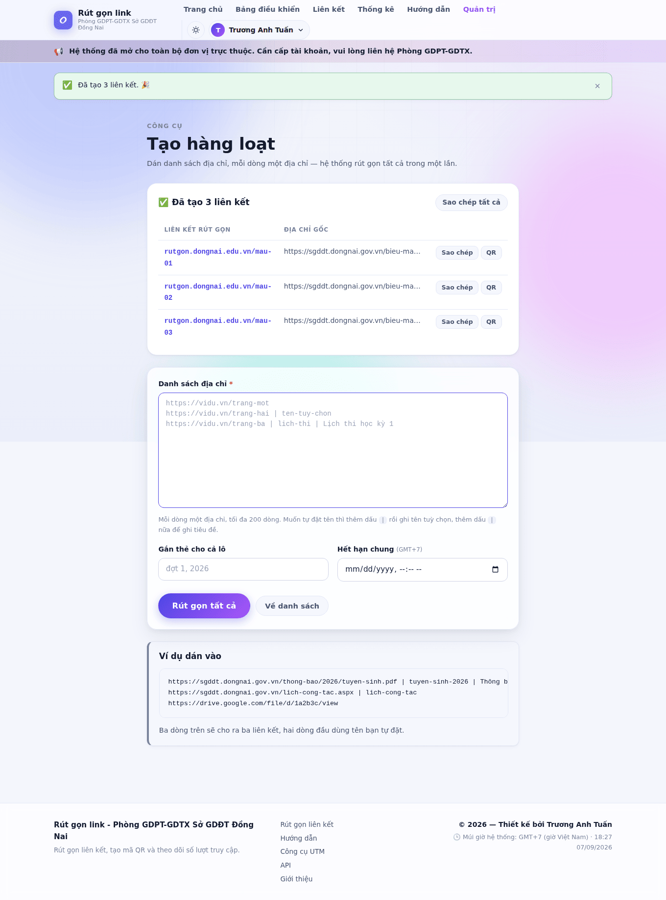

Dòng nào không hợp lệ sẽ được báo riêng kèm lý do, các dòng còn lại vẫn được
tạo bình thường. Mỗi lần xử lý tối đa 200 dòng.

---

## 11. Công cụ gắn thẻ UTM

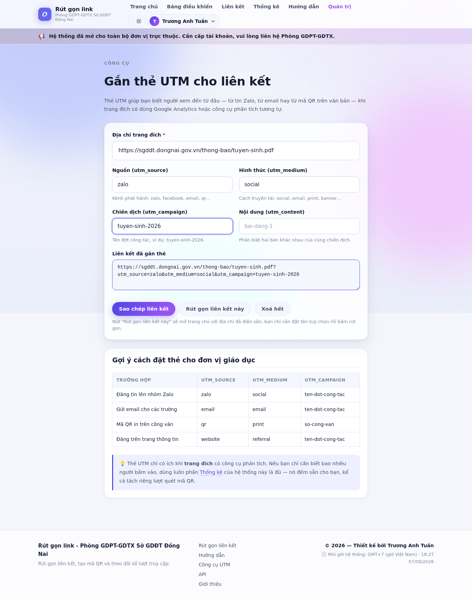

Thẻ UTM giúp biết người xem đến từ đâu **khi trang đích có dùng Google
Analytics** hoặc công cụ phân tích tương tự.

Gợi ý cách đặt cho đơn vị giáo dục:

| Trường hợp | utm_source | utm_medium | utm_campaign |
|---|---|---|---|
| Đăng tin lên nhóm Zalo | `zalo` | `social` | tên đợt công tác |
| Gửi email cho các trường | `email` | `email` | tên đợt công tác |
| Mã QR in trên công văn | `qr` | `print` | số công văn |
| Đăng trên trang thông tin | `website` | `referral` | tên đợt công tác |

> 💡 Nếu bạn **chỉ cần biết bao nhiêu người bấm vào**, dùng luôn phần
> **Thống kê** của hệ thống này là đủ — nó đếm sẵn cho bạn, kể cả tách riêng
> lượt quét mã QR. Thẻ UTM chỉ cần khi trang đích có công cụ phân tích riêng.

---

## 12. Tài khoản của tôi

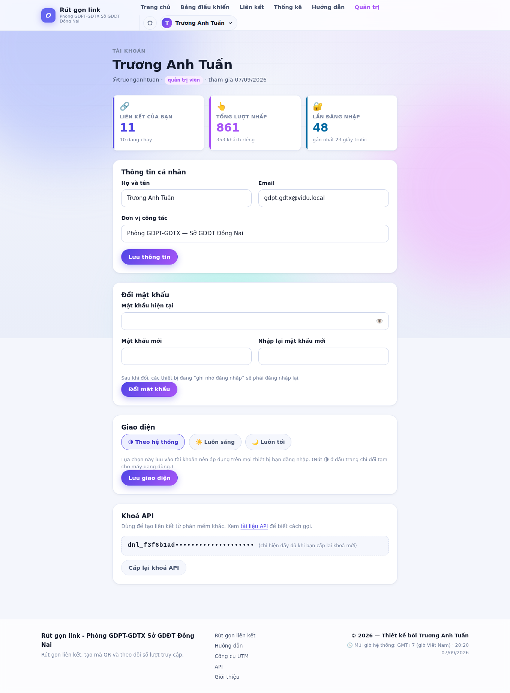

| Mục | Nội dung |
|---|---|
| **Thông tin cá nhân** | Họ tên, email, đơn vị công tác |
| **Đổi mật khẩu** | Có thanh đo độ mạnh. Đổi xong, các thiết bị đang "ghi nhớ đăng nhập" phải đăng nhập lại |
| **Giao diện** | Sáng / Tối / Theo hệ thống — lưu theo tài khoản nên áp dụng trên mọi thiết bị |
| **Khoá API** | Dùng khi muốn tạo liên kết từ phần mềm khác. Xem tài liệu ở trang `/api` |

### Giao diện tối

Bấm nút 🌗 ở đầu trang để đổi nhanh cho máy đang dùng, hoặc vào Tài khoản →
Giao diện để lưu lựa chọn cho mọi thiết bị.

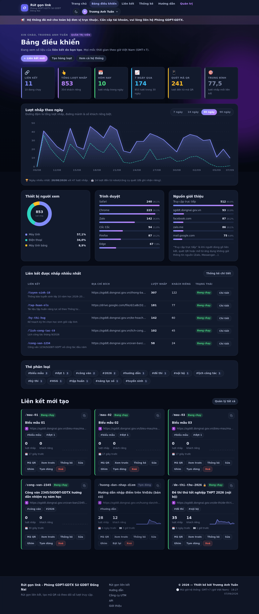

### Dùng trên điện thoại

Toàn bộ hệ thống dùng được trên điện thoại:

<p align="center">
  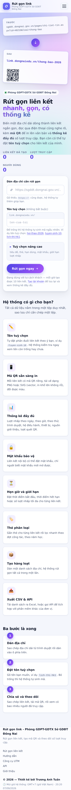
  
</p>

---

## 13. Dành cho quản trị viên

Người dùng **đầu tiên** của hệ thống tự động là quản trị viên. Menu **Quản
trị** chỉ hiện với tài khoản có quyền này.

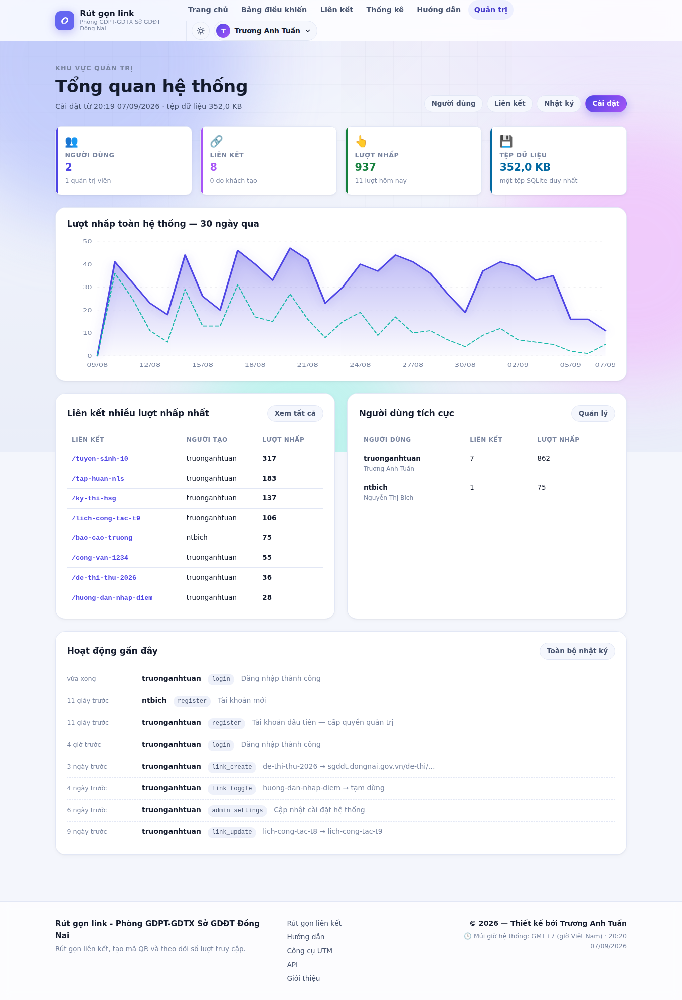

### Quản lý người dùng

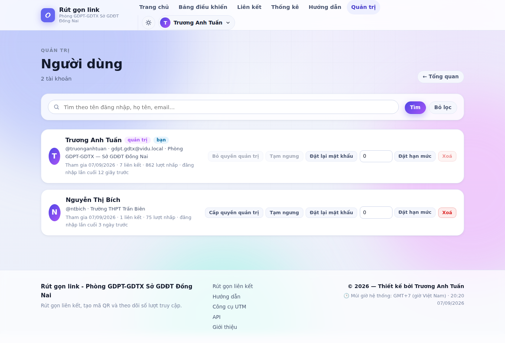

| Thao tác | Ghi chú |
|---|---|
| **Cấp / bỏ quyền quản trị** | Hệ thống luôn giữ ít nhất một quản trị viên |
| **Tạm ngưng / mở lại** | Tài khoản bị ngưng không đăng nhập được |
| **Đặt lại mật khẩu** | Sinh mật khẩu tạm, hiện một lần — chuyển cho người dùng và nhắc họ đổi lại |
| **Đặt hạn mức** | Số liên kết tối đa một người tạo được (0 = không giới hạn) |
| **Xoá tài khoản** | **Liên kết của người đó vẫn hoạt động**, chỉ mất chủ sở hữu |

> Quản trị viên **không thể tự** hạ quyền, tự khoá hay tự xoá tài khoản mình
> — chốt an toàn để không ai tự làm mất lối vào khu quản trị.

### Cài đặt hệ thống

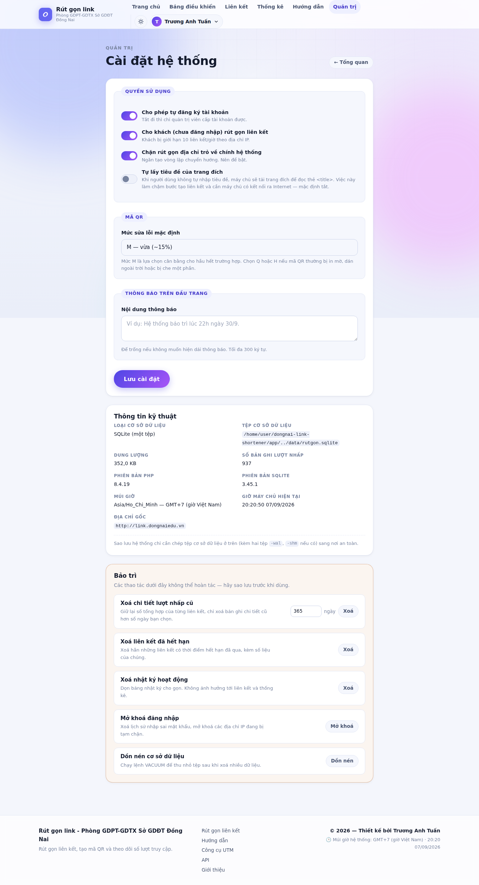

| Cài đặt | Ý nghĩa |
|---|---|
| **Cho phép tự đăng ký** | Tắt đi thì chỉ quản trị viên cấp tài khoản |
| **Cho khách rút gọn** | Tắt đi thì phải đăng nhập mới rút gọn được |
| **Chặn tự trỏ về hệ thống** | Ngăn tạo vòng lặp chuyển hướng. **Nên để bật** |
| **Tự lấy tiêu đề trang đích** | Máy chủ tải trang đích để đọc tiêu đề. Làm chậm bước tạo liên kết và cần máy chủ ra được Internet — mặc định **tắt** |
| **Mức sửa lỗi QR mặc định** | Áp dụng cho mọi mã QR mới |
| **Thông báo đầu trang** | Dải thông báo hiện cho mọi người. Để trống là ẩn |

### Bảo trì

| Thao tác | Khi nào dùng |
|---|---|
| **Xoá chi tiết lượt nhấp cũ** | Tệp dữ liệu phình to. **Số tổng hợp của từng liên kết vẫn giữ nguyên** |
| **Xoá liên kết đã hết hạn** | Dọn các liên kết không còn dùng (mất cả số liệu của chúng) |
| **Xoá nhật ký hoạt động** | Dọn cho gọn, không ảnh hưởng liên kết |
| **Mở khoá đăng nhập** | Khi có người bị khoá do nhập sai nhiều lần |
| **Dồn nén cơ sở dữ liệu** | Chạy sau khi xoá nhiều dữ liệu, để thu nhỏ tệp |

> ⚠️ Các thao tác bảo trì **không hoàn tác được**. Sao lưu trước khi dùng.

### Nhật ký hoạt động

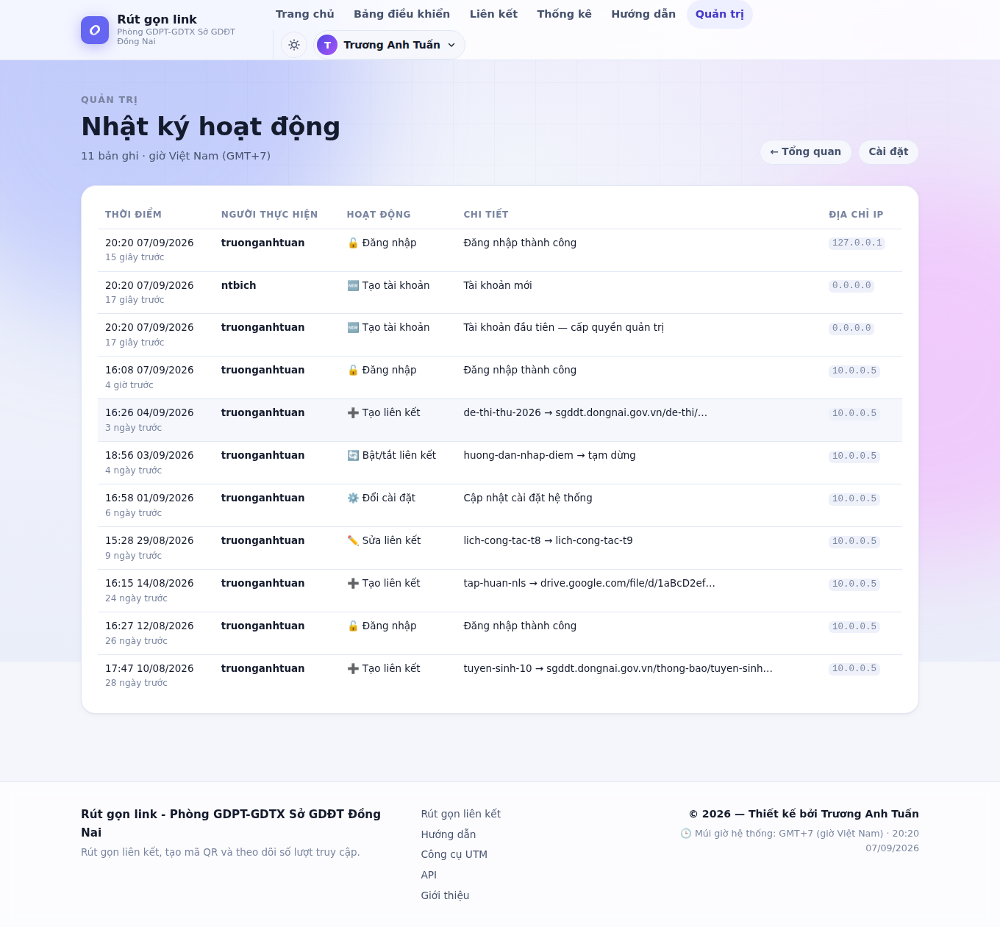

Ghi lại ai làm gì, lúc nào: đăng nhập, tạo/sửa/xoá liên kết, đổi cài đặt.

---

## 14. Câu hỏi thường gặp

<details>
<summary><b>Đổi được địa chỉ đích mà giữ nguyên liên kết ngắn không?</b></summary>

Được, và đây là lý do chính nên dùng hệ thống của đơn vị. Vào **Sửa** liên kết
rồi thay địa chỉ đích. Liên kết ngắn và mã QR đã in ra vẫn dùng bình thường.
</details>

<details>
<summary><b>Tôi quên mật khẩu thì sao?</b></summary>

Dùng **mã dự phòng** nhận được lúc tạo tài khoản, tại trang **Quên mật khẩu**.
Nếu mất luôn mã dự phòng, nhờ quản trị viên đặt lại mật khẩu giúp.
</details>

<details>
<summary><b>Xoá liên kết rồi có lấy lại được không?</b></summary>

Không. Xoá liên kết là xoá luôn số liệu thống kê của nó. Nếu chỉ muốn ngừng
tạm thời, dùng **Tạm dừng**.
</details>

<details>
<summary><b>Liên kết đã in trên văn bản, giờ đổi tên tuỳ chọn được không?</b></summary>

Đổi được nhưng **không nên**: tên cũ sẽ không còn hoạt động, nên mọi bản in và
mã QR đã phát hành đều thành liên kết chết. Nếu buộc phải đổi, hãy **tạo thêm**
một liên kết với tên mới và giữ nguyên liên kết cũ.
</details>

<details>
<summary><b>Vì sao thống kê ghi "Truy cập trực tiếp" nhiều thế?</b></summary>

Vì phần lớn người dùng mở liên kết từ Zalo, Messenger hoặc phần mềm đọc email
— các ứng dụng này không gửi thông tin nguồn cho trang đích. Quét mã QR và gõ
tay cũng vào nhóm này. Đây là chuyện bình thường.
</details>

<details>
<summary><b>Số "khách riêng" có chính xác không?</b></summary>

Là con số **ước lượng**. Hệ thống đếm theo dấu vết ẩn danh tính từ IP và
trình duyệt. Cùng một người dùng hai thiết bị sẽ đếm là hai khách; nhiều
người trong cùng một mạng nội bộ dùng cùng loại thiết bị có thể bị đếm gộp.
Dùng để so sánh tương đối thì tốt, đừng coi là con số tuyệt đối.
</details>

<details>
<summary><b>Mã QR quét không ra, phải làm sao?</b></summary>

Kiểm tra theo thứ tự: (1) mã in có đủ lớn không — tối thiểu 2×2 cm;
(2) có giữ lề trắng quanh mã không; (3) độ tương phản có đủ không;
(4) mã có bị cắt, bị che không. Nếu in ngoài trời hoặc mã hay bị cọ xước,
tăng **mức sửa lỗi** lên Q hoặc H rồi in lại.
</details>

<details>
<summary><b>Dữ liệu được lưu ở đâu? Có gửi ra ngoài không?</b></summary>

Toàn bộ dữ liệu nằm trong **một tệp duy nhất** trên máy chủ của đơn vị.
Không có dữ liệu nào được gửi ra dịch vụ bên ngoài — giao diện cũng không gọi
phông chữ Google hay thư viện CDN nào.
</details>

<details>
<summary><b>Có dùng được khi tắt JavaScript không?</b></summary>

Có. Mọi chức năng chính đều hoạt động: biểu mẫu gửi bằng POST thường, biểu đồ
vẽ sẵn ở máy chủ, mã QR đổi bằng nút **Áp dụng**. JavaScript chỉ để trang
mượt hơn (kiểm tra tên ngay khi gõ, đổi mã QR khi kéo thanh trượt, sao chép
một cú bấm).
</details>

<details>
<summary><b>Có thể gọi từ phần mềm khác không?</b></summary>

Có. Lấy **khoá API** ở trang Tài khoản, xem tài liệu tại `/api` của hệ thống.
Có sẵn các lệnh tạo liên kết, lấy danh sách, đọc thống kê, và địa chỉ ảnh mã
QR dùng trực tiếp.
</details>

---

## 15. Mẹo dùng cho công việc ở Sở

### Đưa mã QR vào công văn

1. Tạo liên kết với tên theo số công văn: `cv-1234`
2. Vào **Mã QR** → chọn mức sửa lỗi **M** → **Tải ảnh PNG** (kích thước ô 10–12)
3. Chèn vào Word, đặt ở góc dưới bên phải, kích thước khoảng 2,5 × 2,5 cm
4. Ghi kèm dòng chữ: *Quét mã hoặc truy cập `rutgon.dongnai.edu.vn/cv-1234`*

Ghi cả liên kết chữ bên dưới mã QR để người không quét được vẫn gõ tay được.

### Phát tài liệu đúng giờ

Cần công bố đề thi thử lúc 7 giờ sáng ngày mai:

1. Tạo liên kết, đặt **Bắt đầu hoạt động từ** = 07:00 ngày mai
2. Gửi liên kết cho các trường từ hôm nay
3. Trước 7 giờ, ai mở cũng thấy "chưa tới giờ"; đúng 7 giờ là tự mở

### Theo dõi một đợt công tác

1. Gắn cùng một **thẻ** cho mọi liên kết của đợt: `tuyen-sinh-2026`
2. Vào **Liên kết** → lọc theo thẻ đó
3. Xuất **CSV** để đưa vào báo cáo

### Tài liệu nội bộ

Đặt **mật khẩu bảo vệ** và gửi mật khẩu qua kênh khác với liên kết (ví dụ
liên kết gửi qua email, mật khẩu đọc qua điện thoại).

### Biểu mẫu có số lượng giới hạn

Đặt **số lượt nhấp tối đa**. Hết lượt là liên kết tự ngừng, không cần trực.

---

## Cần giúp đỡ?

- Cấp tài khoản, đặt lại mật khẩu, báo lỗi: liên hệ **Phòng GDPT-GDTX,
  Sở GDĐT Đồng Nai**
- Hướng dẫn ngắn ngay trong hệ thống: menu **Hướng dẫn**
- Tài liệu API: `/api`

---

© 2026 — **Thiết kế bởi Trương Anh Tuấn** · Phòng GDPT-GDTX Sở GDĐT Đồng Nai
