# Quy trình kỹ thuật

Tài liệu dành cho người quản trị hệ thống và người tiếp nhận bảo trì mã nguồn.
Người dùng cuối xem [Hướng dẫn sử dụng](huong-dan-su-dung.md).

**Hệ thống:** Rút gọn link — Phòng GDPT-GDTX Sở GDĐT Đồng Nai
**Phiên bản:** 1.0.0 · **Múi giờ:** UTC+7 (Asia/Ho_Chi_Minh)

---

## Mục lục

1. [Kiến trúc tổng thể](#1-kiến-trúc-tổng-thể)
2. [Vòng đời một yêu cầu](#2-vòng-đời-một-yêu-cầu)
3. [Cơ sở dữ liệu](#3-cơ-sở-dữ-liệu)
4. [Quy trình rút gọn liên kết](#4-quy-trình-rút-gọn-liên-kết)
5. [Quy trình chuyển hướng và ghi thống kê](#5-quy-trình-chuyển-hướng-và-ghi-thống-kê)
6. [Vòng đời trạng thái liên kết](#6-vòng-đời-trạng-thái-liên-kết)
7. [Quy trình tạo mã QR](#7-quy-trình-tạo-mã-qr)
8. [Xác thực và phân quyền](#8-xác-thực-và-phân-quyền)
9. [Xử lý thời gian UTC+7](#9-xử-lý-thời-gian-utc7)
10. [Bảo mật](#10-bảo-mật)
11. [Quy trình kiểm định](#11-quy-trình-kiểm-định)
12. [Quy trình sao lưu và phục hồi](#12-quy-trình-sao-lưu-và-phục-hồi)
13. [Quy trình nâng cấp phiên bản](#13-quy-trình-nâng-cấp-phiên-bản)
14. [Quy trình phát hành bản mới](#13b-quy-trình-phát-hành-bản-mới)
15. [Xử lý sự cố thường gặp](#14-xử-lý-sự-cố-thường-gặp)

---

## 1. Kiến trúc tổng thể

Hệ thống theo mô hình MVC tối giản, **một cửa vào duy nhất** (`index.php`).
Không dùng Composer, không framework, không thư viện JavaScript ngoài.

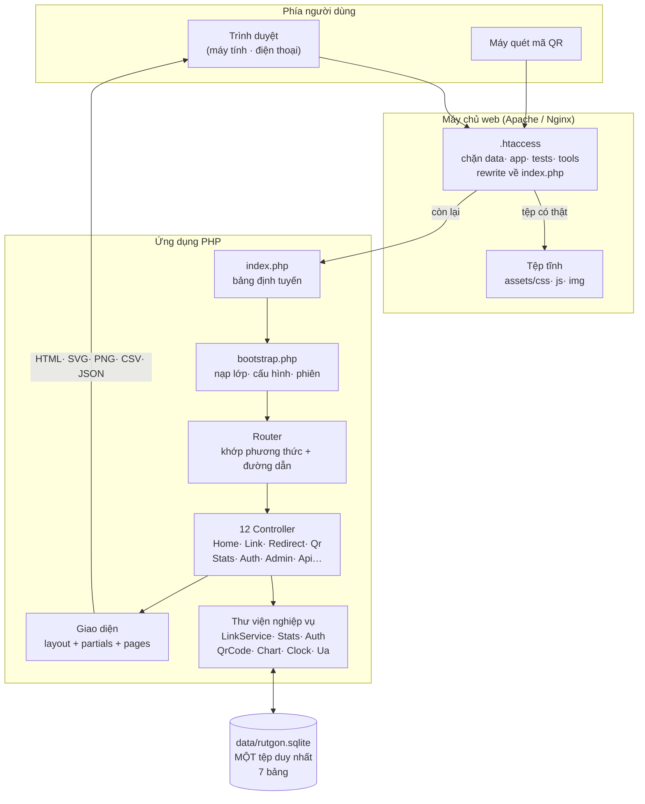

### Nguyên tắc thiết kế

| Nguyên tắc | Lý do |
|---|---|
| Một tệp SQLite duy nhất | Sao lưu chỉ cần chép một tệp; chạy được trên shared hosting không có MySQL |
| Không phụ thuộc thư viện ngoài | Không lo thư viện ngừng bảo trì; không cần Composer trên hosting |
| Biểu đồ vẽ ở máy chủ (SVG) | Hiện ngay khi tải trang, in ra giấy vẫn đúng, không gọi CDN |
| Không gọi dịch vụ bên ngoài | Không tiết lộ danh sách địa chỉ của Sở cho bên thứ ba |
| Hoạt động khi tắt JavaScript | Biểu mẫu gửi bằng POST thường; JS chỉ để mượt hơn |

---

## 2. Vòng đời một yêu cầu

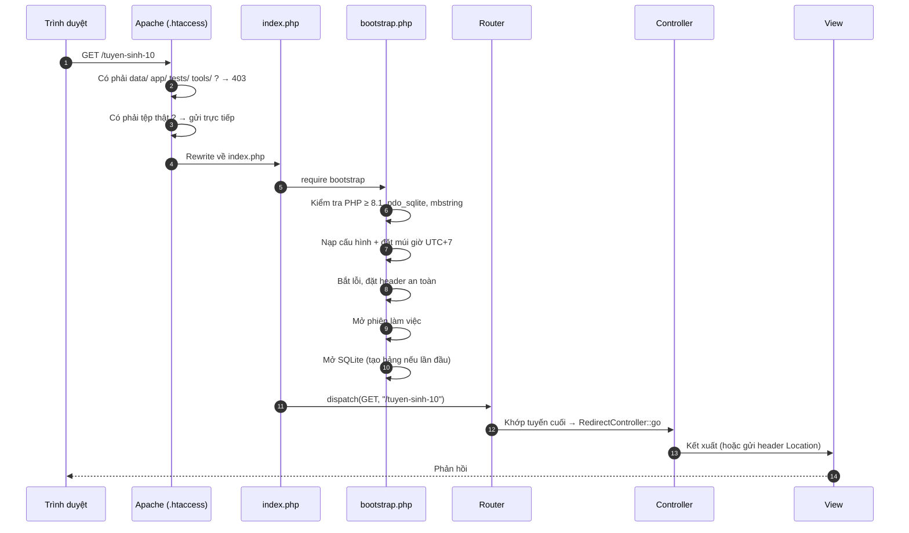

> **Lưu ý về thứ tự tuyến:** tuyến `/{code}` phải đặt **cuối cùng** trong
> `index.php`, sau tất cả tuyến cố định. Nếu đặt trước, nó sẽ "ăn" hết
> `/lien-ket`, `/thong-ke`… Danh sách tên bị giữ nằm trong
> `LinkService::RESERVED`.

---

## 3. Cơ sở dữ liệu

Bảy bảng, tất cả trong `data/rutgon.sqlite`. Bảng được tạo tự động ở lần
truy cập đầu tiên (`Database::migrate()`).

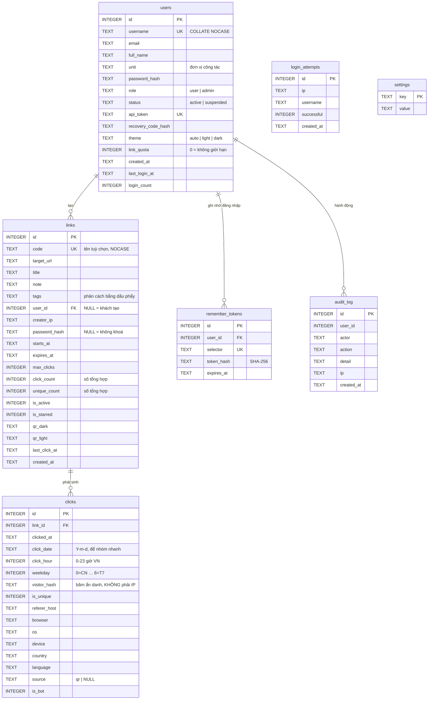

### Ghi chú thiết kế bảng

- **`links.click_count` và `unique_count` là số tổng hợp**, cập nhật cùng lúc
  với việc chèn dòng vào `clicks`. Nhờ vậy trang danh sách không phải đếm lại
  hàng nghìn dòng mỗi lần tải. Khi xoá chi tiết lượt nhấp cũ (mục Bảo trì),
  số tổng hợp **vẫn giữ nguyên** — cố ý như vậy để không mất số liệu lịch sử.
- **`click_date`, `click_hour`, `weekday` được ghi sẵn** lúc phát sinh lượt
  nhấp, tính theo giờ Việt Nam. Nếu để SQLite tự tính từ `clicked_at` thì sẽ
  ra giờ UTC và biểu đồ theo giờ sẽ lệch 7 tiếng.
- **`code` dùng `COLLATE NOCASE`** nên `/Tuyen-Sinh` và `/tuyen-sinh` là một.
- **Xoá người dùng không xoá liên kết** (`ON DELETE SET NULL`): các mã QR đã
  in ra ngoài vẫn hoạt động sau khi người tạo rời đơn vị.
- **Chỉ mục** trên `links(user_id, created_at)`, `clicks(link_id, clicked_at)`,
  `clicks(click_date)`, `clicks(link_id, visitor_hash)`.
- SQLite chạy ở chế độ **WAL** (`journal_mode = WAL`) để đọc và ghi không
  chặn nhau, `busy_timeout = 5000` để chịu được truy cập đồng thời.

---

## 4. Quy trình rút gọn liên kết

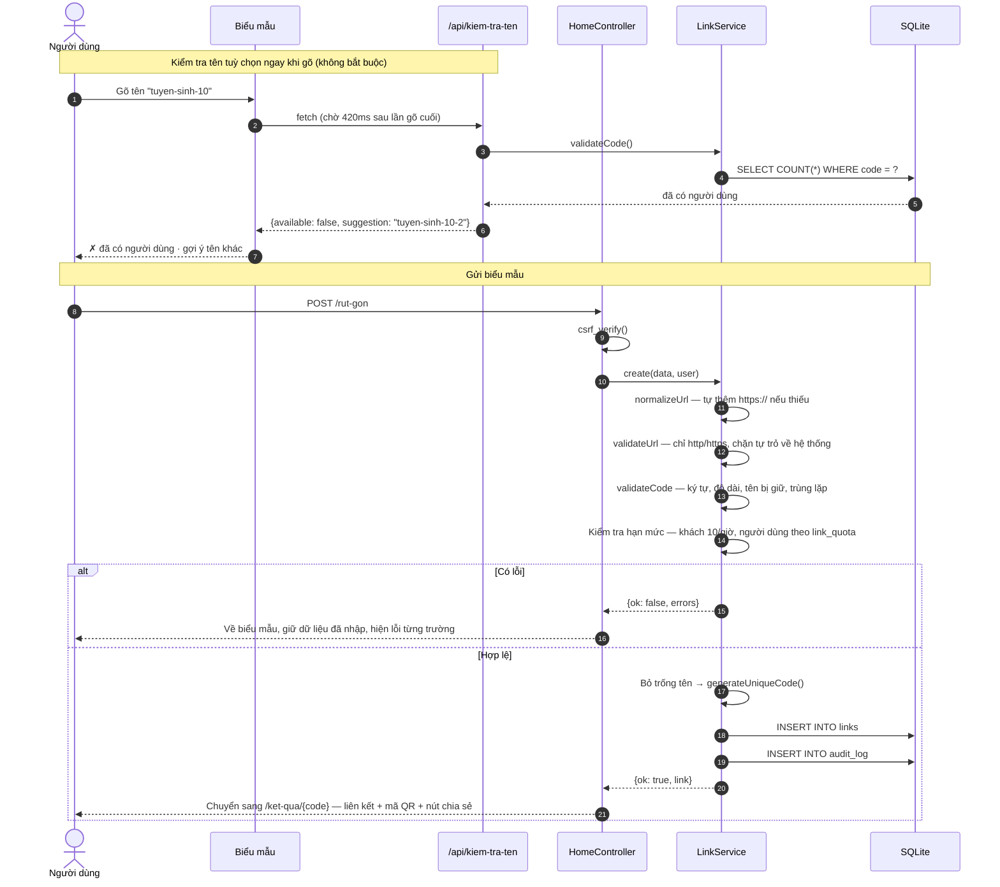

### Quy tắc tên tuỳ chọn (`LinkService::validateCode`)

| Kiểm tra | Quy tắc |
|---|---|
| Độ dài | 3–64 ký tự (`code_min_length` / `code_max_length`) |
| Ký tự cho phép | Chữ không dấu, số, và `-` `_` `.` |
| Vị trí | Phải bắt đầu và kết thúc bằng chữ hoặc số |
| Dấu liền nhau | Không cho hai dấu đặc biệt liền nhau (`a--b` bị từ chối) |
| Tên bị giữ | Không trùng đường dẫn hệ thống (`LinkService::RESERVED`, 45 tên) |
| Trùng lặp | So sánh không phân biệt hoa/thường |

Mã tự sinh dùng bộ ký tự đã **bỏ các chữ dễ nhìn lẫn**: không có `0` `O` `o`
`1` `l` `I`. Xem `code_alphabet` trong `app/config.php`.

---

## 5. Quy trình chuyển hướng và ghi thống kê

Đây là đường đi nóng nhất của hệ thống — mỗi lần ai đó bấm vào liên kết.

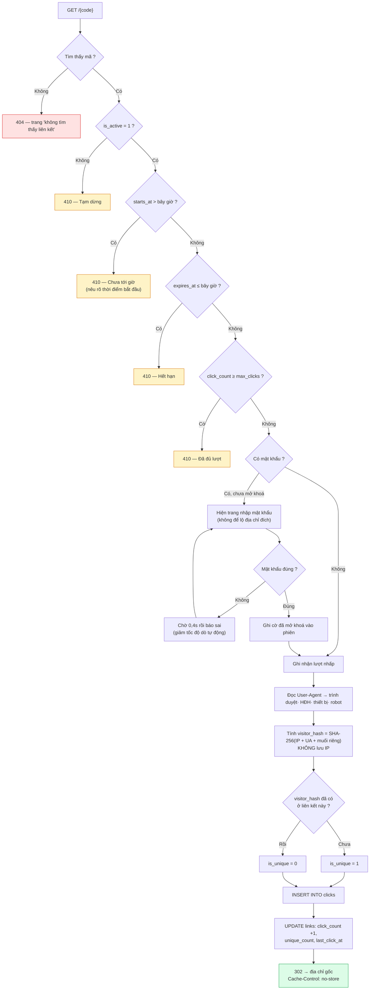

### Vì sao dùng 302 mà không phải 301

Chuyển hướng **302 (tạm thời)** kèm `Cache-Control: no-store`. Nếu dùng 301
(vĩnh viễn), trình duyệt sẽ nhớ và những lần sau đi thẳng tới đích **không
qua máy chủ** — số liệu thống kê sẽ thiếu, và việc sửa địa chỉ đích sẽ không
có tác dụng với người đã bấm một lần.

### Lỗi thống kê không được cản người dùng

`RedirectController::sendTo()` bọc phần ghi thống kê trong `try/catch`. Nếu
cơ sở dữ liệu bị lỗi khi ghi, hệ thống **vẫn chuyển hướng** người dùng tới
đích và chỉ ghi lỗi vào nhật ký. Thống kê là phụ, đưa người dùng tới nơi cần
đến là chính.

---

## 6. Vòng đời trạng thái liên kết

Trạng thái **không lưu trong cơ sở dữ liệu** mà được tính lại mỗi lần cần,
từ bốn cột `is_active`, `starts_at`, `expires_at`, `max_clicks`
(`LinkService::state()`). Nhờ vậy không cần công việc định kỳ để đổi trạng
thái khi tới hạn.

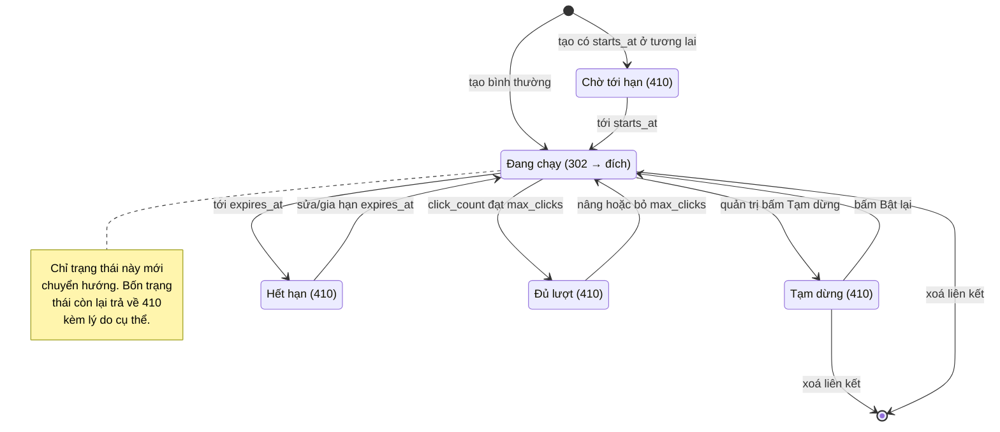

Thứ tự xét trạng thái (quan trọng khi một liên kết vướng nhiều điều kiện):
**Tạm dừng → Chờ tới hạn → Hết hạn → Đủ lượt → Đang chạy.**

---

## 7. Quy trình tạo mã QR

`app/lib/QrCode.php` là bộ mã hoá QR viết riêng, thuần PHP, theo chuẩn
**ISO/IEC 18004**. Hỗ trợ chế độ byte (UTF-8), phiên bản 1–40, bốn mức sửa
lỗi L/M/Q/H.

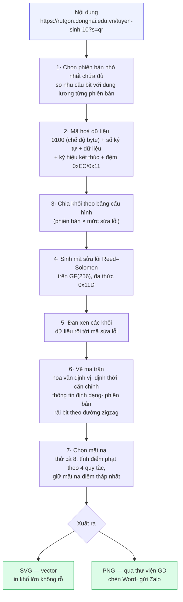

### Vì sao tự viết mà không dùng thư viện

Hosting của đơn vị thường không có Composer, và các thư viện QR đều cần cài
qua Composer. Bộ mã hoá tự viết nằm gọn trong một tệp, không phụ thuộc gì,
và **được kiểm định bằng bộ giải mã độc lập** (xem mục 11).

### Tham số ảnh QR

| Tham số | Ý nghĩa | Miền giá trị |
|---|---|---|
| `co` | Kích thước mỗi ô (px) | 2–30 |
| `le` | Lề trắng quanh mã (số ô) | 0–8 (chuẩn khuyến nghị 4) |
| `mau` | Màu mã, dạng hex | `%23` thay cho `#` |
| `nen` | Màu nền, hoặc `trong` cho nền trong suốt | chỉ SVG hỗ trợ nền trong |
| `sua-loi` | Mức sửa lỗi | 0=L, 1=M, 2=Q, 3=H |
| `nguon` | `0` để bỏ dấu `?s=qr` | mặc định có gắn |
| `tai` | `1` để tải tệp về | |

Mã màu được lọc bằng biểu thức chính quy `^#[0-9a-fA-F]{6}$` trước khi ghép
vào SVG — chặn việc chèn nội dung lạ vào tệp ảnh.

---

## 8. Xác thực và phân quyền

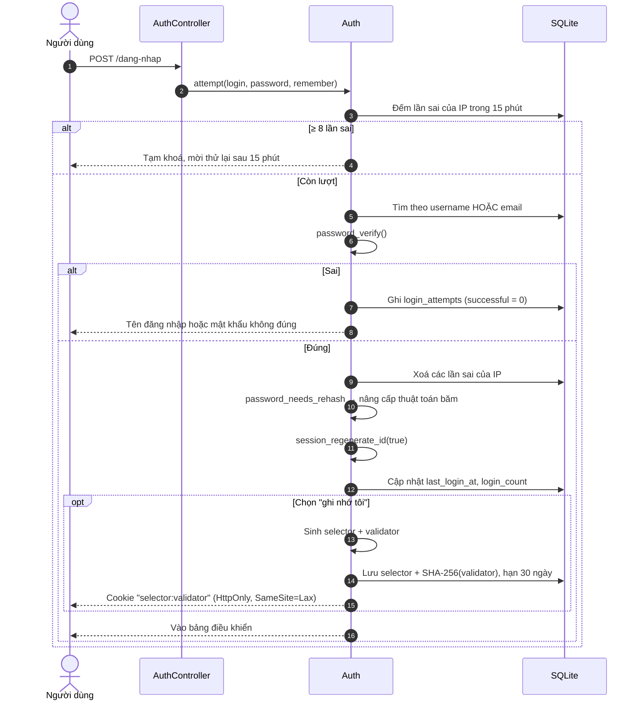

### Cơ chế ghi nhớ đăng nhập

Dùng mô hình **selector + validator**, an toàn hơn cookie chứa mã người dùng:

- Cookie mang `selector:validator`. Cơ sở dữ liệu chỉ lưu `selector` (tra cứu)
  và **SHA-256 của validator** (đối chiếu) — lộ cơ sở dữ liệu cũng không dựng
  lại được cookie.
- **Dùng một lần:** mỗi lần đăng nhập bằng cookie, token cũ bị xoá và cấp
  token mới (chống phát lại).
- Nếu `selector` khớp nhưng `validator` sai → dấu hiệu token bị đánh cắp →
  **xoá toàn bộ token của người đó**, buộc đăng nhập lại.
- Đổi mật khẩu sẽ thu hồi mọi token đang ghi nhớ.

### Cây quyền

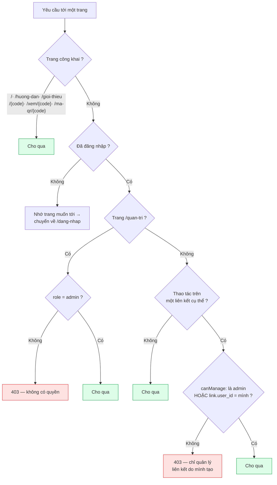

**Người dùng đầu tiên của hệ thống tự động thành quản trị viên**
(`Auth::register()` xét `userCount() === 0`).

Hai chốt an toàn ở khu quản trị:
- Quản trị viên **không thể tự** hạ quyền, tự khoá hoặc tự xoá tài khoản mình.
- Hệ thống luôn giữ **ít nhất một** quản trị viên.

---

## 9. Xử lý thời gian UTC+7

Đây là chỗ dễ sai nhất khi bảo trì, nên tách thành một lớp riêng:
`app/lib/Clock.php`.

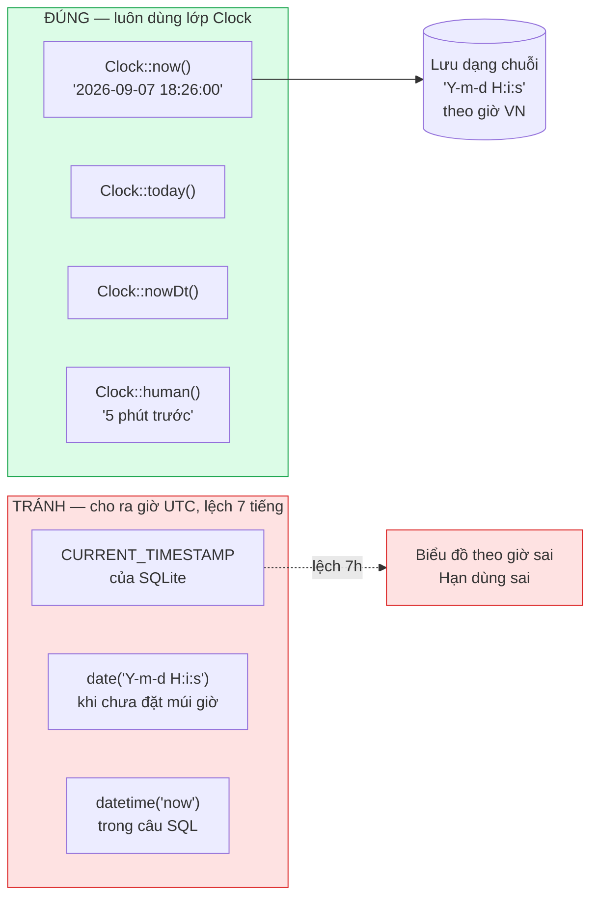

**Quy ước:**

1. `bootstrap.php` gọi `date_default_timezone_set('Asia/Ho_Chi_Minh')` ngay
   từ đầu.
2. Mọi mốc thời gian lưu vào cơ sở dữ liệu là **chuỗi `Y-m-d H:i:s` theo giờ
   Việt Nam**, do PHP sinh ra qua `Clock::now()`.
3. **Không dùng** `CURRENT_TIMESTAMP` hay `datetime('now')` của SQLite — hai
   hàm này trả về giờ UTC.
4. Khi cần mốc thời gian trong câu SQL (ví dụ so với `expires_at`), tính
   trong PHP rồi truyền vào bằng tham số:
   ```php
   $stmt->execute([':now' => Clock::now()]);
   ```
5. Cột `click_hour` và `weekday` được ghi sẵn lúc phát sinh, nên biểu đồ theo
   giờ / theo thứ không phải quy đổi múi giờ.
6. API trả về ISO 8601 kèm độ lệch `+07:00` (`Clock::iso()`).

Bộ kiểm định `tests/app_test.php` có hạng mục xác nhận API ghi đúng
`+07:00`.

---

## 10. Bảo mật

### Các lớp bảo vệ

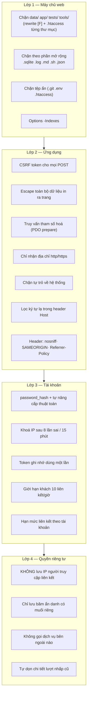

### Chi tiết cần biết khi bảo trì

| Chủ đề | Cách xử lý |
|---|---|
| **CSRF** | Token 32 byte trong phiên; `csrf_verify()` so bằng `hash_equals()`; sai → 419 kèm trang giải thích |
| **XSS** | Hàm `e()` bọc `htmlspecialchars(ENT_QUOTES \| ENT_SUBSTITUTE)`; mọi dữ liệu người dùng in ra đều qua `e()` |
| **SQL injection** | 100% truy vấn dùng `prepare()` + tham số; tên cột động (thống kê) đối chiếu danh sách trắng trước |
| **Chèn mã vào SVG** | Mã màu lọc bằng regex hex 6 ký tự |
| **Header Host** | `base_url()` lọc bằng `preg_replace('/[^A-Za-z0-9\.\-:\[\]]/')`; nên đặt `site_url` để bỏ hẳn phụ thuộc vào Host |
| **SSRF** | Chỉ khi bật "tự lấy tiêu đề trang đích": `Meta::isSafeUrl()` phân giải DNS rồi chặn dải IP nội bộ; mặc định **tắt** |
| **Dò mật khẩu liên kết** | Chờ 0,4 giây sau mỗi lần sai |
| **Nhật ký lỗi** | Ghi vào `data/error.log`, không hiện chi tiết lỗi cho người dùng (`display_errors = 0`) |

> ⚠️ **Nhắc quan trọng:** nếu clone mã nguồn bằng `git` trực tiếp vào
> `public_html`, hãy chắc chắn `.htaccess` được đọc (`AllowOverride All`).
> Không có nó, thư mục `tests/` sẽ chạy được từ web và người ngoài có thể
> gọi `/tests/app_test.php` để tạo hàng loạt dữ liệu rác. Bản phát hành
> `.zip` **đã loại bỏ** `tests/` nên không gặp rủi ro này.

---

## 11. Quy trình kiểm định

```bash
php tests/run_all.php
```

Script tự bật máy chủ trên cổng trống, dùng **cơ sở dữ liệu tạm** (không
đụng dữ liệu thật), chạy bốn bộ test rồi dọn sạch.

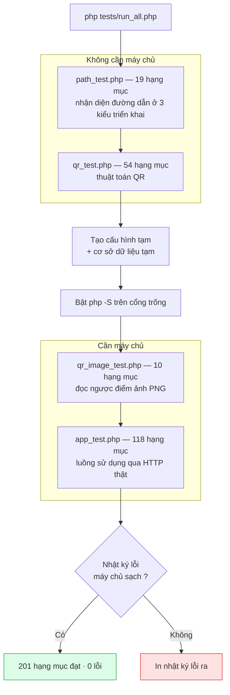

### Điểm mấu chốt: bộ giải mã QR độc lập

`tests/qr_decoder.php` **không dùng lại một dòng nào** của
`app/lib/QrCode.php`. Bản đồ module chức năng, bảng vị trí hoa văn căn chỉnh
và các bảng cấu hình khối trong đó được dựng lại từ mô tả trong chuẩn.

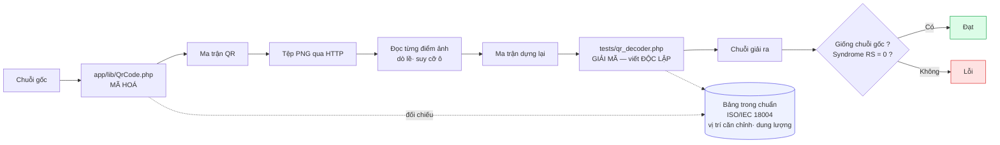

Nhờ cách này, quá trình phát triển đã phát hiện **bảng số khối sửa lỗi mức H
bị sai** — mã QR mức H trước đó sai hoàn toàn mà nhìn bằng mắt không thấy.

### Ba lỗi thật do bộ kiểm định tìm ra

| Lỗi | Hậu quả nếu không phát hiện |
|---|---|
| Bảng `NUM_ECC_BLOCKS` mức H sai từ phiên bản 8 | Mọi mã QR mức sửa lỗi H không quét được |
| `fputcsv()` thiếu tham số `$escape` (PHP 8.4) | Chức năng xuất CSV trả về trang lỗi |
| Đang đăng nhập vẫn POST tạo thêm tài khoản được | Tạo tài khoản ngoài ý muốn, lẫn phiên |

---

## 12. Quy trình sao lưu và phục hồi

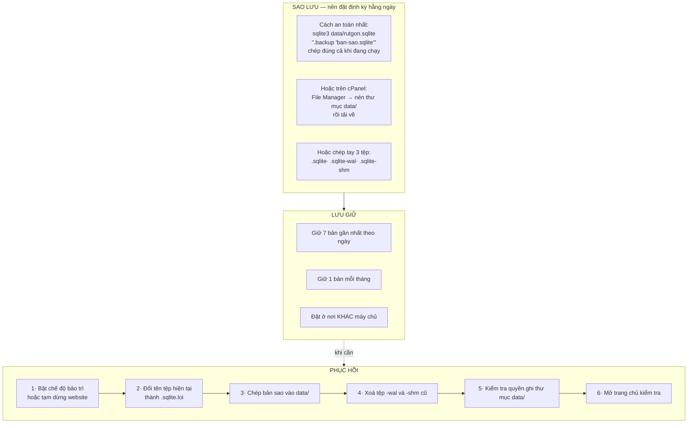

**Cần chép cả tệp `-wal`?** SQLite ở chế độ WAL ghi thay đổi mới vào tệp
`-wal` trước. Nếu chỉ chép tệp `.sqlite` khi hệ thống đang chạy, có thể mất
những thay đổi cuối. Lệnh `.backup` xử lý việc này đúng; nếu chép tay thì
chép cả ba tệp.

**Kiểm tra bản sao có đọc được:**
```bash
sqlite3 ban-sao.sqlite "PRAGMA integrity_check; SELECT COUNT(*) FROM links;"
```

---

## 13. Quy trình nâng cấp phiên bản

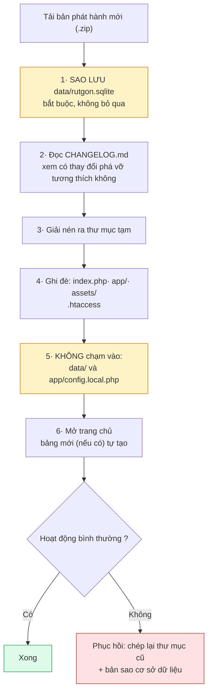

Cấu trúc bảng có phiên bản riêng, lưu ở khoá `schema_version` trong bảng
`settings`. `Database::migrate()` chạy `CREATE TABLE IF NOT EXISTS` mỗi lần
khởi động nên thêm bảng mới là tự động; nếu bản mới cần **đổi cột**, ghi chú
sẽ nằm trong `CHANGELOG.md`.

---

## 13b. Quy trình phát hành bản mới

Dành cho người bảo trì mã nguồn.

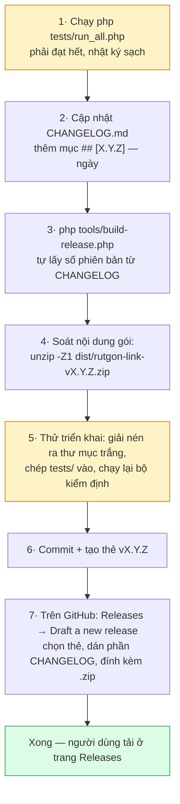

### Đóng gói

```bash
php tools/build-release.php          # lấy số phiên bản từ CHANGELOG.md
php tools/build-release.php 1.1.0    # hoặc chỉ định
```

Kết quả ở `dist/`: tệp `.zip` và tệp `.sha256` đi kèm.

Script dùng **danh sách trắng** các mục đưa vào (`$include`) chứ không phải
danh sách loại trừ — nhờ vậy tệp lạ nằm trong thư mục làm việc không bao giờ
lọt vào bản phát hành. Những thứ bị loại dứt khoát: `tests/`, `tools/`,
`dist/`, `docs/images/`, mọi tệp `.sqlite`, `.log`, và
`app/config.local.php`.

### Hai đường tải, cả hai đều triển khai được ngay

| Đường tải | Nội dung | Ghi chú |
|---|---|---|
| Tệp `.zip` đính kèm ở trang **Releases** | 77 tệp, ~200 KB | Giải nén ra là dùng ngay, có kèm `CAI-DAT-NHANH.txt` |
| Bản `.zip`/`.tar.gz` GitHub tự sinh cho mỗi thẻ | 90 tệp, ~200 KB | Nhờ `export-ignore` trong `.gitattributes` nên cũng không có `tests/`, `tools/`, ảnh tài liệu. Chỉ khác là nội dung nằm trong một thư mục con |

> Nút **"Download ZIP"** ở trang chính của repo (tải nhánh, không phải thẻ)
> **có** chứa `tests/` và `tools/`. Đừng hướng người dùng tải bằng nút đó.

### Kiểm tra trước khi công bố

```bash
# Soát nội dung gói
unzip -Z1 dist/rutgon-link-v1.0.0.zip | head -20

# Thử triển khai thật
mkdir /tmp/thu && cd /tmp/thu
unzip -q ~/dongnai-link-shortener/dist/rutgon-link-v1.0.0.zip
cp -r ~/dongnai-link-shortener/tests ./tests   # tests/ không nằm trong gói
php tests/run_all.php
```

Nếu có Apache, kiểm tra thêm rằng `.htaccess` hoạt động: `/data/rutgon.sqlite`
và `/app/config.php` phải trả về **403**. Máy chủ `php -S` **không đọc**
`.htaccess` nên không kiểm tra được việc này.

---

## 14. Xử lý sự cố thường gặp

| Hiện tượng | Nguyên nhân thường gặp | Cách xử lý |
|---|---|---|
| Trang trắng, không thông báo | Lỗi PHP, `display_errors` đang tắt | Xem `data/error.log` |
| "Thư mục dữ liệu không có quyền ghi" | Quyền thư mục `data/` | `chmod 775 data`, đúng chủ sở hữu là user của máy chủ web |
| Trang chủ chạy, nhưng `/tuyen-sinh-10` báo 404 | Chưa bật `mod_rewrite` hoặc `AllowOverride None` | Bật rewrite; tạm thời dùng `/index.php/tuyen-sinh-10` |
| Mã QR ra tên miền lạ | Chưa đặt `site_url` | Đặt `site_url` trong `app/config.local.php` |
| Liên kết in ra là `http://` dù web chạy https | Proxy/CDN không gửi `X-Forwarded-Proto` | Đặt `site_url` với `https://` |
| Không xuất được PNG, SVG vẫn được | Thiếu phần mở rộng `gd` | Bật `gd` trong cPanel → Select PHP Version → Extensions |
| Biểu đồ theo giờ lệch 7 tiếng | Có chỗ dùng giờ UTC | Kiểm tra mã mới thêm: phải dùng `Clock::`, không dùng `CURRENT_TIMESTAMP` |
| "Phiên làm việc đã hết hạn" (419) | Mở biểu mẫu quá lâu, hoặc cookie bị chặn | Tải lại trang; kiểm tra cookie của trình duyệt |
| Đăng nhập báo tạm khoá | 8 lần sai trong 15 phút | Chờ, hoặc Quản trị → Cài đặt → Bảo trì → Mở khoá đăng nhập |
| Tệp dữ liệu phình to | Nhiều bản ghi chi tiết lượt nhấp | Bảo trì → Xoá chi tiết cũ → Dồn nén (VACUUM) |
| Không đăng nhập được, mất mã dự phòng | — | Nhờ quản trị viên khác đặt lại mật khẩu |
| Mất luôn tài khoản quản trị duy nhất | — | Xem ghi chú bên dưới |

### Mất tài khoản quản trị duy nhất

Không có cửa hậu trong hệ thống. Cách xử lý bằng dòng lệnh trên máy chủ:

```bash
# Cấp quyền quản trị cho một tài khoản đang có
sqlite3 data/rutgon.sqlite "UPDATE users SET role='admin', status='active' WHERE username='ten-dang-nhap';"
```

Nếu không còn tài khoản nào, xoá bảng `users` rồi đăng ký lại — người đăng ký
đầu tiên sẽ thành quản trị viên. **Liên kết và thống kê không bị ảnh hưởng**
(chúng chỉ mất chủ sở hữu):

```bash
sqlite3 data/rutgon.sqlite "DELETE FROM users;"
```

---

## Bản đồ mã nguồn

| Tệp | Trách nhiệm |
|---|---|
| `index.php` | Bảng định tuyến — nơi duy nhất khai báo đường dẫn |
| `app/bootstrap.php` | Nạp lớp, cấu hình, múi giờ, bắt lỗi, phiên làm việc |
| `app/config.php` | Cấu hình tĩnh (`config.local.php` để ghi đè) |
| `app/lib/Database.php` | Kết nối SQLite + tạo bảng |
| `app/lib/LinkService.php` | Nghiệp vụ liên kết: kiểm tra, tạo, sửa, ghi lượt nhấp |
| `app/lib/Stats.php` | Toàn bộ truy vấn thống kê |
| `app/lib/Auth.php` | Đăng ký, đăng nhập, ghi nhớ, phân quyền, nhật ký |
| `app/lib/QrCode.php` | Bộ mã hoá QR (phiên bản 1–40, L/M/Q/H) |
| `app/lib/Chart.php` | Vẽ biểu đồ SVG ở máy chủ |
| `app/lib/Clock.php` | **Mọi** xử lý thời gian UTC+7 |
| `app/lib/Ua.php` | Nhận diện trình duyệt / HĐH / thiết bị / robot |
| `app/lib/Meta.php` | Lấy tiêu đề trang đích (tuỳ chọn, có chống SSRF) |
| `app/lib/Settings.php` | Cấu hình động quản trị viên đổi được |
| `app/lib/Support.php` | Hàm tiện dụng: `e()`, `url()`, CSRF, flash… |
| `app/lib/Router.php` | Khớp tuyến, hỗ trợ tham số `{id:\d+}` |
| `app/controllers/` | 12 bộ xử lý theo nhóm chức năng |
| `app/views/` | `layout.php` + `partials/` + `pages/` |
| `assets/css/app.css` | Toàn bộ giao diện: sáng/tối, responsive, bản in |
| `assets/js/app.js` | Tương tác — **không bắt buộc** để dùng hệ thống |
| `tests/` | Bốn bộ kiểm định + máy chủ thử nghiệm |

---

© 2026 — **Thiết kế bởi Trương Anh Tuấn** · Phòng GDPT-GDTX Sở GDĐT Đồng Nai
